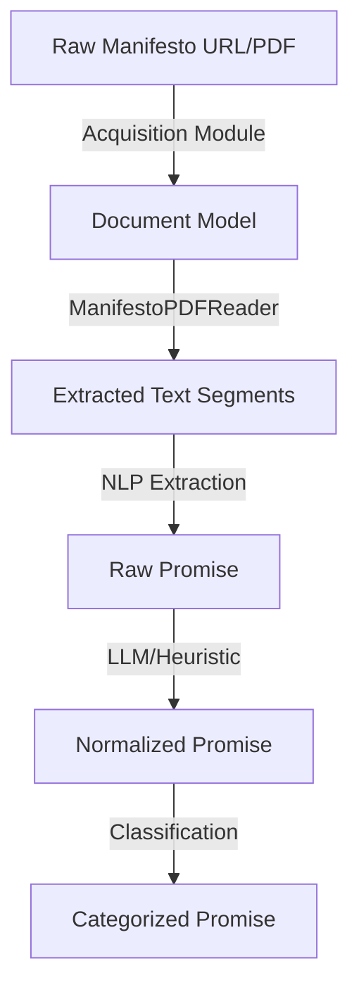
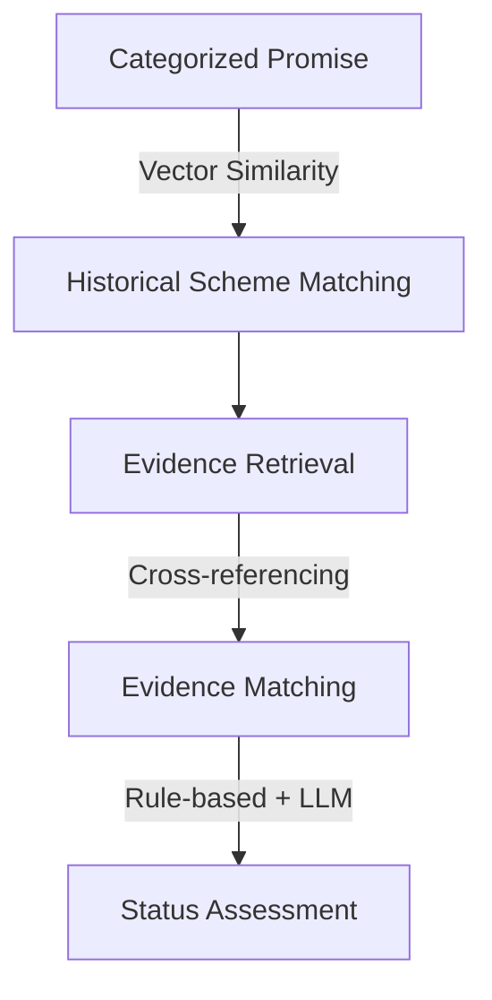
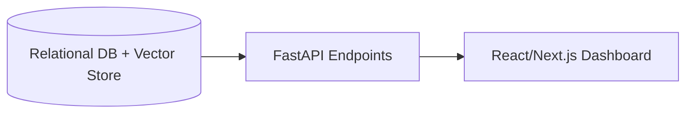

# Phase 3: Political Promise Tracker - Architecture

## Overview
The architecture for Phase 3 extends the data foundation established in Phases 1 and 2. It introduces specialized modules for textual extraction, promise isolation, and semantic matching against the existing `HistoricalScheme` and `BudgetRecord` datasets.

## Data Flow & Processing Stages

### 1. Data Acquisition
The reusable acquisition layer (`backend/acquisition/`) handles fetching from:
- Official party websites
- Public archives
- Government/election sources
- Secondary sources (when necessary for discovery)

### 2. Processing Flow

### 3. Intelligence & Matching Flow

### 4. Output Flow

## Inventory of Components

### Reusable Phase 1/2 Components (Do Not Rebuild)
- **Provenance System**: `backend/models/common.py` (`Source`, `DataSource`, `Document`, `Evidence`).
- **Scheme Intelligence**: `backend/models/budget.py` (`HistoricalScheme`, `BudgetScheme`, vector embeddings).
- **Document Ingestion Base**: `backend/ingestion/readers.py` (PDF and CSV reader base classes).
- **Database Infrastructure**: SQLAlchemy setup and vector/JSON storage paradigms.
- **Acquisition Layer Base**: `backend/acquisition/http_client.py` and `SourceRecord` dataclasses.

### Components to be Built for Phase 3
1. **Promise NLP Extractor**: A dedicated module in `backend/nlp/` to isolate discrete promises from `ExtractedManifestoSegment` text blocks.
2. **Promise Normalizer & Categorizer**: A service to map extracted promises into standardized domain taxonomies (e.g., matching Phase 1 `SchemeCategory`).
3. **Promise Database Models**: New SQLAlchemy models (e.g., `PoliticalPromise`) linking to `HistoricalScheme` and `Evidence`.
4. **Evidence Matching Engine**: A semantic search component that compares a normalized promise against budget records and scheme details.
5. **Status Assessor Service**: An evaluation engine that assigns rigid status flags (`not_assessed`, `announced`, `implemented`, etc.) based on matched evidence.
6. **Promise API Routers**: FastAPI endpoints exposing promises, matched evidence, and calculated statuses.
7. **Promise Tracker Dashboard**: Frontend components to visualize promise fulfillment percentages and trace evidence back to the manifesto text.
