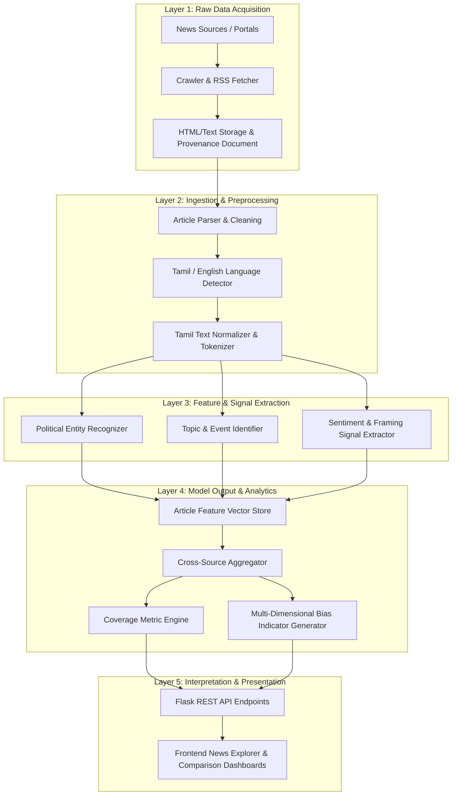

# Phase 4 — Tamil News Bias & Political Coverage Analyzer Architecture

## 1. Executive Summary & Objective

Phase 4 of **CIVICLENS TN** introduces the **Tamil News Bias & Political Coverage Analyzer**. The system systematically ingests, parses, normalizes, and analyzes political and news coverage across Tamil and English media outlets covering Tamil Nadu politics and civic issues.

### Key Objectives:
- Real-time and archival news article ingestion across Tamil and English sources.
- Structured language detection and text normalization (specifically tailored for Tamil script and English political discourse).
- Multi-granular entity extraction (Political Persons, Parties, Departments, Constituencies, Organizations).
- Event detection and topic taxonomy classification.
- Multi-dimensional framing and stance indicator calculation.
- Evidence-based, cross-source comparative coverage analytics.
- Integration into the existing CIVICLENS TN data provenance and evidence tracking core.

> [!IMPORTANT]
> **Neutral Terminology Principle:** The system explicitly avoids single-score accusations such as *"News Source X is biased"*. Instead, all comparative outputs are framed strictly using objective, evidence-backed statistical indicators: *coverage difference, framing divergence, sentiment variation, topic emphasis, entity prominence, quote balance, and omission/presence patterns*.

---

## 2. System Pipeline Architecture

The Phase 4 pipeline enforces strict decoupling across five primary processing layers:

---

## 3. Data Pipeline Layer Specifications

### 3.1 Raw Data Layer
- **Inputs:** RSS feeds, sitemaps, HTTP page HTML from registered media outlets and official government portals.
- **Storage:** Stores raw HTML payloads in `scratch/raw_articles/` and logs full provenance metadata into the `Document` and `Source` tables (reused from `backend/models/common.py`).
- **Traceability:** Every ingested record creates a unique URL hash and timestamps retrieval.

### 3.2 Ingestion & Preprocessing Layer
- **Article Parsing:** Extracts structured headline, body paragraphs, author, publication date, category, and canonical URL.
- **Duplicate Detection:** Performs exact hash matching (`text_hash`) and fuzzy similarity matching (MinHash/LSH) on cleaned content to flag syndicated or duplicated articles.
- **Language Detection:** Identifies Tamil (Unicode range `\u0B80`–`\u0BFF`), English, or code-mixed text.
- **Tamil Text Normalization:** Applies NFKC Unicode normalization, standardizes Tamil script variations, strips zero-width joiners, and handles Tamil punctuation.

### 3.3 Feature & Signal Extraction Layer
- **Entity Extraction:** Matches text against `PoliticalEntity`, `PoliticalPerson`, `PoliticalParty`, and `BudgetDepartment` tables using regex patterns, named entity recognition (NER), and gazetteer lookup.
- **Topic & Event Identification:** Maps articles to predefined policy/political topics (`Topic`) and real-world political events (`PoliticalEvent`).
- **Framing & Stance Signals:** Calculates headline vs. body sentiment scores, quote counts, attribution ratios, and official source citations.

### 3.4 Model Output & Analytics Layer
- **Article Feature Vectors:** Persists structured metrics into `ArticleFeature`, `ArticleEntity`, `ArticleTopic`, and `ArticleEvent`.
- **Cross-Source Comparison Engine:** Aggregates coverage metrics over sliding time windows (daily, weekly, monthly) across sources for given topics, parties, or events.
- **Statistical Indicator Calculator:** Computes normalized divergence scores across outlets without declaring subjective labels.

### 3.5 Interpretation & Presentation Layer
- **API Blueprints:** Modular endpoints under `/api/news/` delivering JSON responses for sources, articles, comparative analytics, topic trends, and bias indicators.
- **Frontend Dashboards:** Interactive views including News Explorer, Source Comparison matrix, Event Coverage timeline, and Entity Prominence heatmaps.

---

## 4. Integration with Existing Infrastructure

Phase 4 seamlessly integrates with pre-existing CIVICLENS TN architectural components:

1. **Database & Provenance:**
   - Builds upon `Base` from `backend.database.base_class`.
   - Links news articles directly to `Document` and `Evidence` records in `backend/models/common.py` to maintain an unbroken audit chain from raw news article to verified policy/promise evidence.
2. **Backend & API Architecture:**
   - Mounts under `backend/api/news.py` and registers with the main Flask router in `backend/api/routes.py`.
   - Reuses standard response formatters `success_response` and `error_response` from `backend/api/responses.py`.
3. **NLP Infrastructure:**
   - Leverages `backend/nlp/preprocessing.py` and embedding models from `backend/nlp/embeddings.py` for semantic similarity and text processing.
4. **Configuration & Logging:**
   - Uses `backend/core/config.py` for operational parameters and `backend/core/logger.py` for structured operational logging.

---

## 5. Storage & Database Schema Relationship

The database schema introduces dedicated tables for Phase 4:

- **`news_sources`**: Outlets, domains, languages, collection policies, and operational statuses.
- **`news_articles`**: Extracted articles with metadata, language flags, and provenance links.
- **`news_article_versions`**: Tracking updates/revisions to news articles over time.
- **`political_parties` & `political_persons`**: Entities representing political actors in Tamil Nadu.
- **`political_entities`**: Generic entity registry (departments, constituencies, organizations).
- **`political_events`**: Ground-truth political and civic events.
- **`news_topics`**: Predefined taxonomy of civic/political news themes.
- **`article_entities` / `article_topics` / `article_events`**: Junction tables capturing mentions, positions, and prominence scores.
- **`article_features`**: Extracted NLP signals (sentiment, framing, quotes, source citations).
- **`coverage_metrics`**: Pre-aggregated periodic statistics per source/topic/party.
- **`bias_indicators`**: Pairwise/groupwise comparative statistical indicators across news sources.
- **`source_snapshots`**: Time-stamped snapshots of source-level coverage distribution.

---

## 6. Testing & Quality Assurance Principles

- **Test Isolation:** All test cases use synthetic fixtures with `is_test_fixture=True` and clear headers (`TEST FIXTURE — NOT REAL NEWS DATA`).
- **No Fabricated Real News:** No fake political claims or real-world bias conclusions are tested or stored.
- **Pipeline Auditing:** Test suites validate ingestion, parsing, duplicate detection, language identification, statistical indicator calculation, and API responses.
