# Phase 4 — Neutral Framing & Multi-Dimensional Bias Methodology

This document outlines the theoretical framework, mathematical definitions, multi-dimensional indicators, and neutral language standard for analyzing political news coverage in **CIVICLENS TN Phase 4**.

---

## 1. Core Principles & Neutral Terminology Standard

### 1.1 Non-Subjective Stance Safeguard
Political coverage analysis is vulnerable to subjective interpretations and algorithmic bias. To prevent arbitrary claims, **CIVICLENS TN enforces strict non-judgmental principles**:

1. **No Single-Score Bias Ratings:** The system *never* outputs binary ratings (e.g., "Biased" vs "Unbiased") or single scalar bias scores (e.g., "78% Biased").
2. **Neutral Terminology Enforcement:** Terms such as *"biased"*, *"fake news"*, *"propaganda"*, or *"corrupt"* are prohibited in model output and user-facing dashboards.
3. **Indicator-Based Reporting:** All comparative measurements are presented as *statistical indicators* quantifying concrete differences in coverage, framing, selection, and language usage across media outlets.

### 1.2 Approved Neutral Terminology Mapping

| Prohibited Subjective Term | Standardized Neutral Terminology |
| :--- | :--- |
| "Outlet X is biased towards Party A" | *"Outlet X exhibits higher coverage frequency and entity prominence for Party A."* |
| "Sensationalized / Negative Reporting" | *"Higher negative sentiment score in headline phrasing relative to body text."* |
| "News Suppression / Media Censorship" | *"Omission pattern: Topic T was covered by N outlets, but unrepresented in Outlet X during window W."* |
| "Pro-Government Propaganda" | *"High proportion of official government source quotes relative to independent quotes."* |
| "Unbalanced Coverage" | *"Framing divergence score across comparative outlet baseline."* |

---

## 2. Multi-Dimensional Indicator Framework

Bias cannot be captured by sentiment analysis alone. Phase 4 measures **12 distinct analytical dimensions**:

```mermaid
flowchart TD
    subgraph Dimension Categories
        A[Linguistic & Sentiment Signals]
        B[Entity & Event Prominence]
        C[Topic & Selection Dynamics]
        D[Source Sourcing & Structural Signals]
    end

    A --> A1[1. Headline Sentiment]
    A --> A2[2. Article Body Sentiment]
    A --> A3[4. Framing Polarization]
    A --> A4[8. Wording & Lexical Divergence]

    B --> B1[3. Entity Prominence Score]
    B --> B2[6. Event Coverage Frequency]
    B --> B3[7. Political Entity Frequency]

    C --> C1[5. Topic Emphasis & Allocation]
    C --> C2[12. Omission / Presence Differential]

    D --> D1[9. Article Depth & Word Count]
    D --> D2[10. Quote Distribution & Balance]
    D --> D3[11. Official vs Independent Source Ratio]
```

---

## 3. Mathematical Definitions of the 12 Dimensions

### Dimension 1: Headline Sentiment ($S_{headline}$)
Measures polarity of headline text using VADER / IndicSentiment models fine-tuned for Tamil and English news headlines.
$$S_{headline} \in [-1.0, +1.0]$$

### Dimension 2: Article Body Sentiment ($S_{body}$)
Measures polarity across all body paragraphs, capturing context beyond headline hook phrasing.
$$S_{body} \in [-1.0, +1.0]$$

### Dimension 3: Entity Prominence Score ($P_{entity}$)
Quantifies the visibility of a political entity $e$ in article $a$ based on mention frequency ($N_{mentions}$), presence in lead paragraph ($L \in \{0, 1\}$), and title presence ($T \in \{0, 1\}$):
$$P_{entity}(e, a) = 0.4 \cdot T + 0.3 \cdot L + 0.3 \cdot \min\left(1.0, \frac{N_{mentions}}{5}\right)$$

### Dimension 4: Framing Polarization ($F_{framing}$)
Measures directional stance framing (positive, neutral, critical) associated with specific political entities within target sentences:
$$F_{framing}(e, a) = \frac{\sum_{s \in S(e)} \text{Sentiment}(s)}{|S(e)|}$$
where $S(e)$ represents the set of sentences mentioning entity $e$.

### Dimension 5: Topic Emphasis & Allocation ($E_{topic}$)
Measures the proportion of an outlet’s total published articles ($N_{total}$) allocated to a specific civic topic $t$ during time window $W$:
$$E_{topic}(t, \text{src}, W) = \frac{N_{articles}(t, \text{src}, W)}{N_{total}(\text{src}, W)}$$

### Dimension 6: Event Coverage Frequency ($C_{event}$)
Quantifies how rapidly and frequently a source covers a confirmed political event $E$ relative to rival outlets:
$$C_{event}(E, \text{src}) = \text{Count of published articles covering event } E$$

### Dimension 7: Political Entity Frequency ($F_{entity}$)
Tracks total mention volume of political parties and key leaders across a source's corpus over time:
$$F_{entity}(p, \text{src}, W) = \sum_{a \in \text{Articles}(\text{src}, W)} N_{mentions}(p, a)$$

### Dimension 8: Wording & Lexical Divergence ($D_{lexical}$)
Measures TF-IDF / embedding divergence in vocabulary choices when two sources describe the same political event:
$$D_{lexical}(\text{src}_1, \text{src}_2, E) = 1.0 - \text{CosineSimilarity}(V_{\text{src}_1, E}, V_{\text{src}_2, E})$$

### Dimension 9: Article Depth & Word Count ($W_{depth}$)
Calculates mean word count and structural detail of coverage for specific topics across outlets:
$$W_{depth}(t, \text{src}) = \text{Mean word count of articles in topic } t$$

### Dimension 10: Quote Distribution & Balance ($Q_{balance}$)
Measures the breakdown of direct/indirect quotes attributed to governing party members versus opposition party members:
$$Q_{balance}(\text{src}, W) = \frac{\text{Quotes}_{\text{Gov}}(\text{src}, W)}{\text{Quotes}_{\text{Gov}}(\text{src}, W) + \text{Quotes}_{\text{Opp}}(\text{src}, W)}$$

### Dimension 11: Official vs. Independent Source Ratio ($R_{sourcing}$)
Evaluates reliance on official government press releases vs. independent investigative sources:
$$R_{sourcing}(a) = \frac{N_{\text{official\_citations}}(a)}{N_{\text{total\_citations}}(a)}$$

### Dimension 12: Omission / Presence Differential ($O_{diff}$)
Identifies major political events or policy releases covered by $\ge 75\%$ of tracked outlets but completely absent from source $\text{src}_i$:
$$O_{diff}(E, \text{src}_i) = \begin{cases} 1 & \text{if } E \text{ covered by } \ge 75\% \text{ peers AND absent in } \text{src}_i \\ 0 & \text{otherwise} \end{cases}$$

---

## 4. End-to-End Traceability & Explainability

To ensure full transparency and auditability:
1. Every calculated `BiasIndicator` record contains references to the exact underlying `ArticleFeature` and `Article` records.
2. Every `Article` links directly to a `Document` and `Evidence` record in the database.
3. Users inspecting an indicator on the frontend can click through to inspect the exact articles, paragraph snippets, and source URLs that generated the metric.
