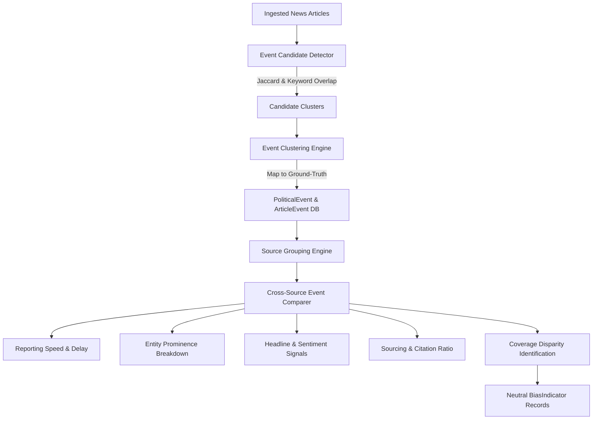

# Phase 4.6 — Cross-Source Political Event Comparison Documentation

## Overview

The **Cross-Source Political Event Comparison** engine detects when multiple Tamil and English media outlets report on the same underlying political or legislative event in Tamil Nadu. It clusters related articles, calculates comparative coverage metrics, and exposes multi-dimensional disparity signals using neutral terminology.

> [!IMPORTANT]
> The engine strictly avoids single scalar bias claims such as *"Outlet X is biased"*. Instead, all comparative findings are framed using neutral statistical terminology such as `coverage disparity`, `reporting timing variation`, and `entity emphasis difference`. All development data uses synthetic test fixtures tagged with `is_test_fixture=True`.

---

## Architecture & Pipeline Flow

---

## Comparative Metrics

### 1. Reporting Speed & Delay
Measures the time difference (in minutes) between the earliest published article on an event across all outlets and the first article published by a specific outlet.
$$\Delta t_{\text{delay}} = t_{\text{source\_first}} - t_{\text{earliest\_global}}$$

### 2. Entity Prominence Breakdown
Calculates the average entity prominence score for every political person, party, or department across articles published by an outlet for the event.
$$P(e, s) = \frac{1}{|A_s|} \sum_{a \in A_s} \text{prominence}(e, a)$$

### 3. Sourcing & Official Citation Ratio
Measures the ratio of official government citations relative to total quotes and citations in an outlet's coverage:
$$\text{Ratio}_{\text{citation}} = \frac{\text{Official Citations}}{\max(1, \text{Total Quotes} + \text{Official Citations})}$$

### 4. Neutral Disparity Identification
- **`coverage_disparities`**: Triggered when an active outlet omits reporting on an event covered by rival outlets.
- **`entity_emphasis_difference`**: Triggered when the average prominence of an entity diverges by $\ge 0.4$ between two outlets covering the same event.

---

## REST API Endpoints

### 1. Detect Event Candidates
`GET /api/news/events/candidates?days_window=3`
- **Query Params**: `days_window` (default: 3)
- **Response**: Array of candidate article clusters with `cluster_id`, `title_sample`, and `article_ids`.

### 2. Compare Event Coverage across Outlets
`GET /api/news/events/<event_id>/compare`
- **Path Param**: `event_id`
- **Response**: Detailed breakdown per media outlet including `reporting_delay_minutes`, `entity_prominence_breakdown`, `signals` (sentiment, quotes, citations), and `coverage_disparities`.

### 3. Get All Coverage Disparities
`GET /api/news/events/disparities`
- **Response**: List of all cross-source coverage disparity records across events.

---

## Testing & Fixtures
All unit tests in `tests/unit/test_phase4_event_comparison.py` verify candidate detection, event clustering, cross-source metrics calculation, and API responses using synthetic test fixtures (`is_test_fixture=True`, `"TEST FIXTURE — NOT REAL NEWS DATA"`).
