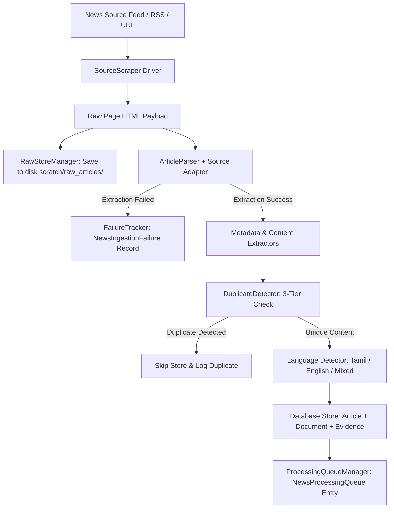

# Phase 4.3 — News Ingestion & Raw Article Pipeline

This document defines the architectural specification, provenance rules, duplicate detection logic, failure tracking, and processing queue workflow for the **CIVICLENS TN News Ingestion Pipeline**.

---

## 1. End-to-End Pipeline Architecture

The ingestion pipeline converts unstructured web media pages into standardized, provenance-tracked article records ready for downstream NLP entity extraction and framing analysis.

---

## 2. Mandatory Provenance & Article Attributes

Every ingested article record in the `news_articles` table preserves an unbroken audit chain:

| Field Name | Description | Example / Standard Value |
| :--- | :--- | :--- |
| `article_id` | Primary key identifier | `"art_9f8a7c6b5e"` |
| `source_id` | Registered news outlet identifier | `"src_dinamani_ta"` |
| `url` | Original web URL fetched | `"https://www.dinamani.com/tamil-nadu/..."` |
| `canonical_url` | HTML `<link rel="canonical">` target | `"https://www.dinamani.com/tamil-nadu/..."` |
| `retrieval_date` | UTC timestamp when page was scraped | `"2026-10-08T10:45:00Z"` |
| `publication_date` | Date article was published | `"2026-10-08T06:00:00Z"` |
| `title` | Extracted article headline | `"சென்னை மெட்ரோ இரண்டாம் கட்டப் பணிகள் பற்றிய அறிக்கை"` |
| `author` | Bylined author or agency | `"Staff Reporter"` |
| `section` | News category section | `"Tamil Nadu"` |
| `language` | Language classification (`"ta"`, `"en"`, `"mixed"`) | `"ta"` |
| `raw_html_path` | Absolute file reference to stored raw HTML | `"scratch/raw_articles/src_dinamani_ta/2026-10-08/a1b2c3d4e5f6.html"` |
| `text_hash` | SHA-256 hash of normalized body text | `"e3b0c44298fc1c149afbf4c8996fb92427ae41e4649b934ca495991b7852b855"` |

---

## 3. Multi-Tier Duplicate Detection Engine

To prevent storing syndicated, republished, or re-scraped articles, `DuplicateDetector` applies three sequential checks:

1. **Tier 1: Canonical & Exact URL Check**
   - Compares incoming URL and `canonical_url` against existing `Article.url` and `Article.canonical_url` database entries.
2. **Tier 2: Content Hash Matching (Exact Text Similarity)**
   - Computes SHA-256 hash of whitespace-normalized body text and queries `Article.text_hash`.
3. **Tier 3: Fuzzy Title + Date Window Similarity Check**
   - For articles published within a 48-hour date window ($\pm 2$ days), computes word-level Jaccard similarity across headlines.
   - If Jaccard similarity score $\ge 0.80$, the article is flagged as a duplicate and logged without redundant database insertion.

---

## 4. Failure Tracking & Audit Log (No Silent Drops)

When a fetch error, parser failure, or validation issue occurs, the system **never silently discards** the record. Instead:

- The error is captured by `FailureTracker` and written to the `news_ingestion_failures` database table.
- Attributes logged: `source_id`, `url`, `failure_type` (`HTTP_ERROR`, `PARSER_ERROR`, `EMPTY_CONTENT`, `ROBOTS_DISALLOWED`, `VALIDATION_ERROR`), `error_details`, `raw_html_path`, `failed_at`.
- If raw page HTML was retrieved prior to parsing failure, `raw_html_path` preserves the raw payload for offline developer debugging.

---

## 5. Downstream Processing Queue Workflow

Upon successful ingestion:
1. `NewsIngestionPipeline` creates an `Article` record.
2. Links unified core provenance records (`Document` and `Evidence` in `backend/models/common.py`).
3. Enqueues the article into `news_processing_queue` with status `PENDING`.
4. Downstream NLP workers poll `ProcessingQueueManager.fetch_pending()` to perform entity extraction, topic classification, and framing feature calculation.

---

## 6. Multilingual & Mixed-Language Support

`MultilingualLanguageDetector` analyzes Tamil script characters (`\u0B80`–`\u0BFF`) and English alphabetic characters:
- **`ta` (Tamil):** Tamil character ratio $> 15\%$.
- **`en` (English):** Standard English text.
- **`mixed` (Code-Mixed):** Significant presence of both Tamil script and English words (e.g. Tanglish news reports or bilingual government bulletins).

---

## 7. Unit Testing Guidelines

All unit tests verify pipeline components using synthetic local HTML payloads tagged with `is_test_fixture=True` and clear headers (`TEST FIXTURE — NOT REAL NEWS DATA`). Real news website content is never scraped during unit test execution.
