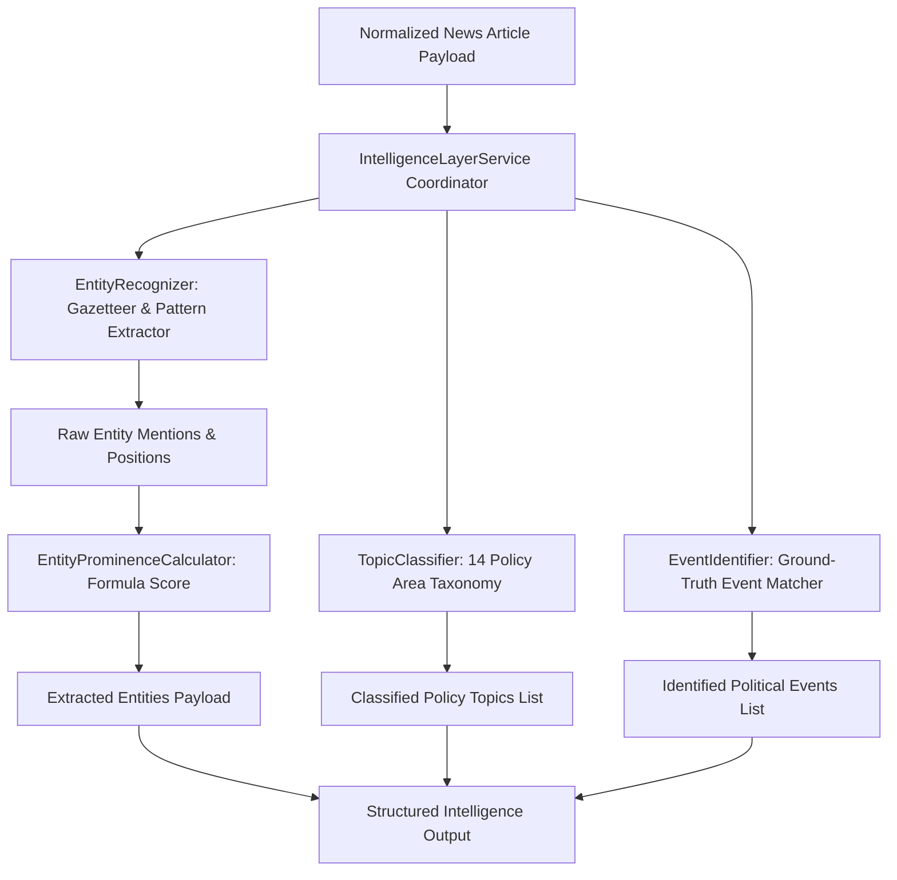

# Phase 4.5 — Political Entity, Topic & Event Intelligence Layer

This document defines the architectural specification, named entity taxonomy, 14-category policy topic classification, prominence scoring formula, and decoupling principles for the **CIVICLENS TN Intelligence Layer**.

---

## 1. Overview & Architecture

The Phase 4.5 Intelligence Layer extracts structured civic signals from normalized news articles. It categorizes political actors, administrative bodies, geographic locations, and ground-truth events while classifying articles across 14 policy areas.



---

## 2. Entity Taxonomy

The intelligence layer extracts seven distinct categories of civic entities:

| Category Name | Database `entity_type` | Description | Examples |
| :--- | :--- | :--- | :--- |
| **PEOPLE** | `person` | Political leaders, ministers, opposition leaders, MPs, MLAs. | M.K. Stalin, Edappadi K. Palaniswami, O. Panneerselvam, Udhayanidhi Stalin, K. Annamalai, Seeman, Thol. Thirumavalavan |
| **POLITICAL PARTIES** | `political_party` | Registered political parties and coalitions. | DMK, AIADMK, BJP, INC, NTK, VCK, PMK |
| **GOVERNMENT DEPARTMENTS** | `government_department` | State executive departments and ministries. | Department of Finance, Department of School Education, Department of Health & Family Welfare |
| **LOCATIONS** | `location` | Districts, major cities, regions, state boundaries. | Chennai, Madurai, Coimbatore, Tiruchirappalli, Tamil Nadu |
| **CONSTITUENCIES** | `constituency` | Assembly & Parliamentary electoral constituencies. | Kolathur, Edappadi, Chepauk, Thousand Lights, Sriperumbudur |
| **ORGANIZATIONS** | `organization` | Judicial bodies, commissions, administrative unions. | Madras High Court, Election Commission of India, State Planning Commission |
| **POLITICAL EVENTS** | `political_event` | Legislative sessions, budget releases, press conferences. | TN Budget Presentation 2026, Assembly Session |

---

## 3. Policy Area Topic Classification Taxonomy (14 Categories)

Articles are classified across 14 standardized policy and civic categories:

1. **`elections`**: Polls, voter registration, nominations, campaign rallies, ballot counting.
2. **`governance`**: Assembly debates, cabinet decisions, executive orders (GOs), official statements.
3. **`education`**: Schools, universities, exams, scholarships, higher education, syllabus.
4. **`healthcare`**: Hospitals, public health, doctors, medicines, epidemic control, clinics.
5. **`agriculture`**: Farming, crops, paddy, irrigation, monsoons, fertilizers, procurement.
6. **`welfare`**: Social security schemes, rations, subsidies, pensions, women empowerment.
7. **`employment`**: Jobs, recruitment notifications, vacancies, skill development, salaries.
8. **`infrastructure`**: Metro expansion, roads, bridges, buses, railways, power & electricity.
9. **`economy`**: State budget, taxation, revenue allocation, investments, industrial growth.
10. **`law_and_order`**: Police administration, courts, judicial verdicts, crime investigation, safety.
11. **`environment`**: Climate action, forest conservation, rivers, pollution, water bodies.
12. **`technology`**: Digital initiatives, e-governance portals, software parks, IT infrastructure.
13. **`social_issues`**: Social justice, reservation, community rights, linguistic affairs.
14. **`other`**: General civic reports and uncategorized media updates.

---

## 4. Entity Prominence Scoring Formula

Entity prominence quantifies how central an entity is to a specific news report:

$$P_{entity} = 0.4 \cdot T + 0.3 \cdot L + 0.3 \cdot \min\left(1.0, \frac{N_{mentions}}{5}\right)$$

- **$T \in \{0, 1\}$:** `1` if entity appears in the headline/title; `0` otherwise.
- **$L \in \{0, 1\}$:** `1` if entity appears in the lead paragraph (first 300 words); `0` otherwise.
- **$N_{mentions}$:** Total count of entity mentions across body text.
- **Output Range:** $P_{entity} \in [0.0, 1.0]$.

---

## 5. Strict Separation & Decoupling Safeguards

To prevent algorithmic bias or arbitrary stance labelling:

> [!IMPORTANT]
> **Decoupling Principle:** The system strictly separates **ENTITY DETECTION** from **SENTIMENT** and **BIAS ANALYSIS**.
> - Mentioning a politician or party **never** automatically implies positive, negative, or biased coverage.
> - Entity prominence measures *visibility*, not *favorability*.
> - Sentiment analysis is computed independently at the clause/sentence level.
> - Bias indicators represent comparative statistical divergence across news outlets over sliding time windows.

---

## 6. Developer API Usage Example

```python
from backend.nlp.intelligence_layer import IntelligenceLayerService

service = IntelligenceLayerService()
analysis = service.analyze_article(
    headline="TEST FIXTURE — Chief Minister M.K. Stalin Inaugrates Chennai Metro Expansion",
    body_text="TEST FIXTURE — NOT REAL NEWS DATA. Chief Minister M.K. Stalin presented the budget for DMK administration in Chennai."
)

print(analysis["entities"])  # Extracted leaders/parties with prominence scores
print(analysis["topics"])    # Ranked 14-category topic list (e.g. infrastructure, governance)
print(analysis["events"])    # Matched ground-truth events
```
