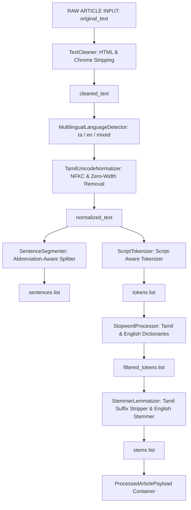

# Phase 4.4 — Multilingual News NLP Pipeline

This document defines the architecture, Tamil Unicode preservation strategy, sentence segmentation logic, tokenization rules, and stemming framework for the **CIVICLENS TN Multilingual News NLP Pipeline**.

---

## 1. Pipeline Architecture

The NLP pipeline transforms raw scraped article text into structured sentence, token, and stem payloads without modifying or destroying the original raw text.



---

## 2. Text Immutability & Payload Specification

To ensure end-to-end explainability and auditability, the pipeline **never overwrites or destroys the original raw text**. Every output returns a `ProcessedArticlePayload` containing:

| Attribute | Data Type | Description |
| :--- | :--- | :--- |
| `original_text` | Text | Exact raw string passed into the pipeline (unmodified). |
| `cleaned_text` | Text | HTML tags, scripts, and entity-decoded text. |
| `normalized_text` | Text | NFKC Unicode normalized and zero-width character stripped text. |
| `language` | String | Identified language (`"ta"`, `"en"`, `"mixed"`). |
| `processing_version` | String | Pipeline version string (e.g., `"nlp_v1.0"`). |
| `sentences` | List of Strings | Segmented sentence list. |
| `tokens` | List of Strings | Full word token list. |
| `filtered_tokens` | List of Strings | Tokens with language-specific stopwords removed. |
| `stems` | List of Strings | Inflectionally stemmed/lemmatized tokens. |
| `stats` | Dictionary | Token counts, language ratios, and vocabulary richness scores. |

---

## 3. Tamil Unicode Preservation Strategy

Tamil Unicode characters reside in the range `\u0B80`–`\u0BFF`. Standard English NLP libraries (such as NLTK or SpaCy English models) corrupt Tamil script diacritics and compound letters (*Uyirmei Ezhuthukkal*).

### Unicode Safeguards Applied:
1. **Normalization Form Canonical Composition (NFKC):** Ensures base consonant characters (*Mei*) and vowel sign diacritics (*Uyir meiyaakka குறியீடுகள்*) are unified into canonical Unicode sequences.
2. **Zero-Width Character Removal:** Strips hidden non-printable zero-width characters (`\u200C` ZWNJ, `\u200D` ZWJ, `\u200B` ZWSP, `\u00AD` soft hyphens) introduced by web publishing CMS systems.
3. **Diacritic & Aytham Safeguard:** Preserves *pulli* (dot above consonant), *aytham* (`ஃ`), and vowel markers (`ா`, `ி`, `ீ`, `ு`, `ூ`, `ெ`, `ே`, `ை`, `ொ`, `ோ`, `ௌ`).
4. **Tamil Punctuation & Quotes:** Normalizes curly quotes (`“`, `”`, `‘`, `’`) to standard ASCII quotes without stripping Tamil script characters.

---

## 4. Multilingual & Code-Mixed Handling

The pipeline evaluates character script distribution to assign one of three language modes:

- **`ta` (Tamil):** Tamil character ratio $> 15\%$ and English ratio $\le 20\%$. Applies Tamil stopword lists and Tamil suffix stemming.
- **`en` (English):** Standard English text. Applies English stopword lists and Porter-style English stemming.
- **`mixed` (Code-Mixed / Tanglish):** Tamil character ratio $> 35\%$ AND English character ratio $> 15\%$. Applies composite Tamil + English stopword filtering and dual-script stemming.

---

## 5. Abbreviation-Aware Sentence Segmentation

Standard sentence splitters split on every period (`.`), incorrectly breaking titles and abbreviations (e.g., `"M.K. Stalin"`, `"Rs. 500 Cr"`, `"Dr. A.P.J. Abdul Kalam"`).

`SentenceSegmenter` protects periods in:
- English and Tamil abbreviations (`mr`, `dr`, `prof`, `govt`, `dept`, `rs`, `cr`, `no`, `m.k`, `c.m`).
- Decimal numbers (e.g., `500.50`).
- Valid sentence bounds (`.`, `!`, `?`, `|`, `\n`) are preserved for splitting.

---

## 6. Stopwords & Stemming Specification

- **Tamil Stopwords:** Predefined dictionary of 30+ Tamil grammatical particles (`மற்றும்`, `ஆனால்`, `எனவே`, `அல்லது`, `என்று`, `ஒரு`, `இந்த`, `அந்த`, `இது`, `அது`, `உள்ள`, `மூலம்`, `பற்றி`).
- **Tamil Suffix Stemming:** Strips case suffixes (`-களுக்கு`, `-ங்களின்`, `-இல்`, `-க்கு`, `-ஐ`, `-ஆல்`), verbal tenses (`-பட்டது`, `-கிறது`, `-ந்தது`), and clitics (`-உம்`, `-ஏ`).
- **English Stemming:** Strips inflectional suffixes (`-ing`, `-ed`, `-es`, `-s`, `-ly`).

---

## 7. Developer API Usage

```python
from backend.nlp.multilingual_pipeline import MultilingualNewsNLPPipeline

pipeline = MultilingualNewsNLPPipeline()
payload = pipeline.process(
    original_text="TEST FIXTURE — சென்னை மெட்ரோ திட்ட பணிகளுக்கு Rs 500 crore நிதி ஒதுக்கீடு செய்யப்பட்டது."
)

print(payload.language)           # "mixed"
print(payload.sentences)          # Segmented sentences list
print(payload.filtered_tokens)   # Tokens without stopwords
print(payload.to_dict())          # Full JSON-serializable dictionary
```
