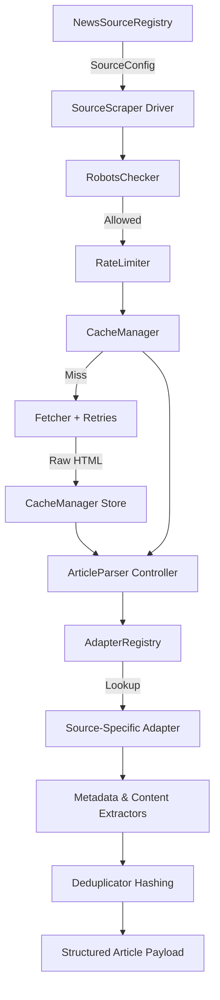

# Phase 4.2 — News Source Registry & Web Scraping Framework

This document provides the developer reference, architectural specification, and operational guide for the **CIVICLENS TN Reusable Web Scraping Framework**.

---

## 1. Overview & Architecture

The Phase 4.2 scraping framework is designed as a domain-decoupled, adapter-driven web acquisition engine. It isolates core network resilience (rate limiting, retries, caching, robots.txt compliance) from source-specific HTML parsing rules.



---

## 2. Core Scraper Components

| Component Class | Module File | Primary Responsibility |
| :--- | :--- | :--- |
| **`NewsSourceRegistry`** | `news_registry.py` | Loads and manages source configuration attributes from `config/news_sources.json`. |
| **`SourceScraper`** | `news_scraper_framework.py` | Orchestrates crawl workflows, URL discovery, fetching, deduplication, and parsing. |
| **`Fetcher`** | `news_scraper_framework.py` | Executes HTTP requests with automatic retries, exponential backoff, and cache check. |
| **`RateLimiter`** | `news_scraper_framework.py` | Enforces domain-keyed crawl delays (e.g. 2.5s per request). |
| **`CacheManager`** | `news_scraper_framework.py` | Persists raw HTML responses to disk (`scratch/cache/http/`) with TTL validation. |
| **`RobotsChecker`** | `news_scraper_framework.py` | Audits target domain `robots.txt` using `urllib.robotparser`. |
| **`Deduplicator`** | `news_scraper_framework.py` | Performs URL canonicalization and SHA-256 text hash duplicate detection. |
| **`ArticleParser`** | `news_scraper_framework.py` | Delegates extraction to registered `BaseSourceAdapter` instances. |
| **`AdapterRegistry`** | `news_adapters.py` | Dynamic factory holding pluggable site-specific parser adapters. |

---

## 3. Source Registry Configuration Schema (`config/news_sources.json`)

Every media outlet or government media portal is registered via a declarative JSON specification:

```json
{
  "source_id": "src_thehindu_en",
  "source_name": "The Hindu (Tamil Nadu Edition)",
  "domain": "thehindu.com",
  "language": "en",
  "article_url_patterns": [
    "/news/national/tamil-nadu/.*",
    "/news/cities/chennai/.*"
  ],
  "pagination_rules": {
    "param_name": "page",
    "page_step": 1,
    "max_pages": 5,
    "url_template": "https://www.thehindu.com/news/national/tamil-nadu/?page={page}"
  },
  "parser_type": "thehindu_adapter",
  "rate_limit": 2.5,
  "enabled": true,
  "access_notes": "Compliant with robots.txt; open RSS feed; 2.5s delay.",
  "rss_urls": [
    "https://www.thehindu.com/news/national/tamil-nadu/feeder/default.rss"
  ],
  "selectors": {
    "title": "h1.title, h1.article-title",
    "body": "div[id^='content-body-'] p, div.article-body p",
    "author": "span.author-name, a.person-name",
    "date": "meta[property='article:published_time']"
  }
}
```

---

## 4. Step-by-Step: Adding a New News Source Without Modifying Core Scraper Code

To onboard a new media outlet (e.g. `Puthiya Thalaimurai` or `BBC Tamil`), follow these 3 decoupled steps:

### Step 1: Add Configuration Entry
Edit `config/news_sources.json` to define domain rules, rate limits, RSS feed URLs, and CSS selectors:

```json
{
  "source_id": "src_puthiyathalaimurai_ta",
  "source_name": "Puthiya Thalaimurai",
  "domain": "puthiyathalaimurai.com",
  "language": "ta",
  "article_url_patterns": ["/tamilnadu/.*"],
  "parser_type": "puthiyathalaimurai_adapter",
  "rate_limit": 2.0,
  "enabled": true,
  "rss_urls": ["https://www.puthiyathalaimurai.com/rss.xml"],
  "selectors": {
    "title": "h1.story-head",
    "body": "div.story-detail p"
  }
}
```

### Step 2: Implement Source Adapter
Create a custom adapter class in `backend/acquisition/news_adapters.py` subclassing `GenericSourceAdapter`:

```python
from backend.acquisition.news_adapters import GenericSourceAdapter, adapter_registry

class PuthiyaThalaimuraiAdapter(GenericSourceAdapter):
    """Custom parser adapter for Puthiya Thalaimurai."""
    
    def parse_article(self, html_content: str, url: str, selector_config: dict = None):
        parsed = super().parse_article(html_content, url, selector_config)
        if parsed and parsed["title"]:
            # Custom site-specific string cleaning
            parsed["title"] = parsed["title"].replace(" - புதிய தலைமுறை", "").strip()
        return parsed

# Register adapter with global registry
adapter_registry.register_adapter("puthiyathalaimurai_adapter", PuthiyaThalaimuraiAdapter())
```

### Step 3: Run Ingestion Trigger
Call `SourceScraper.crawl_source()` using the registered `source_id`:

```python
from backend.acquisition.news_scraper_framework import SourceScraper

scraper = SourceScraper()
articles = scraper.crawl_source("src_puthiyathalaimurai_ta", max_articles=10)
```

> [!TIP]
> The core scraper engine (`news_scraper_framework.py`) does **not** need to be recompiled or modified when adding new news sources.

---

## 5. Resilience & Rate Limiting

1. **Per-Domain Crawl Delays:** `RateLimiter` maintains a timestamp map per domain and sleeps automatically if requests are made faster than `source_config.rate_limit`.
2. **Exponential Backoff:** `Fetcher` retries failed network calls up to 3 times, applying exponential delay multipliers (`1.5^attempt`).
3. **Robots.txt Auditing:** `RobotsChecker` parses `https://<domain>/robots.txt` before issuing network requests.

---

## 6. Caching & Deduplication

- **Disk Caching:** HTML responses are hashed using SHA-256 and stored in `scratch/cache/http/<hash>.json` with a 24-hour default TTL.
- **Canonical URL Normalization:** `Deduplicator` strips tracking parameters (`?utm_source=...`) to ensure canonical URL uniqueness.
- **Text Hash Deduplication:** Article body text is normalized and hashed via SHA-256 to prevent duplicate storage of syndicated news articles.

---

## 7. Testing Strategy

All unit and integration tests use synthetic HTML page fixtures tagged with `is_test_fixture=True` and clear headers (`TEST FIXTURE — NOT REAL NEWS DATA`). Real copyrighted news content is never scraped during routine test execution.
