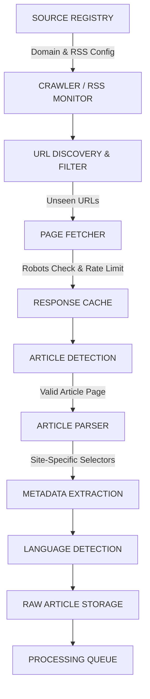

# Phase 4 — Modular Web Scraping & Ingestion Architecture

This document defines the web scraping architecture, parsing workflows, resilience patterns, and provenance tracking for the **Tamil News Bias & Political Coverage Analyzer**.

---

## 1. Modular Scraping Pipeline Architecture

The scraping architecture is engineered as a domain-configurable, resilient pipeline:



---

## 2. Component Specifications

### 2.1 Source Registry & Configuration Engine
- Stores domain definitions, crawl rules, entry-point RSS URLs, site-specific CSS/XPath selectors, and polling intervals.
- Example JSON Configuration Structure:
```json
{
  "source_id": "src_dinamani_ta",
  "domain": "dinamani.com",
  "rss_urls": ["https://www.dinamani.com/all-editions/tamil-nadu/rss.xml"],
  "article_url_patterns": ["/tamil-nadu/\\d+/", "/tamilnadu/\\d+/"],
  "selectors": {
    "title": "h1.article-headline, h1.story-title",
    "body": "div.article-content p, div.story-detail p",
    "author": "span.author-name, div.byline",
    "date": "time[datetime], meta[property='article:published_time']"
  },
  "rate_limit_delay_sec": 2.5,
  "user_agent_tier": "research_bot"
}
```

### 2.2 URL Discovery & Canonicalization
- **RSS Parser:** Reads feed updates and extracts target article link tags.
- **Sitemap Crawling:** Inspects `sitemap.xml` files for daily news articles.
- **Canonical URL Resolution:** Inspects `<link rel="canonical" href="...">` tags to collapse duplicate tracking paths (e.g., query params, mobile URLs).

### 2.3 Page Fetcher & Response Caching
- **HTTP Client:** Uses `httpx` or `requests` with custom session management, automatic compression, and timeout limits (default: 15s).
- **Caching Layer:** Persists HTTP responses in local SQLite/disk cache (`scratch/cache/http/`) with HTTP `ETag` and `If-Modified-Since` header validation to avoid re-downloading unchanged articles.
- **Robots.txt Parser:** Checks `urllib.robotparser` before every network request.

### 2.4 Duplicate Detection & Article Classification
- **Content Hashing:** Computes SHA-256 hash of cleaned text content.
- **Fuzzy Deduplication:** Generates 64-bit SimHash / MinHash signatures to identify republished or syndicated news reports.
- **Heuristic Article Classifier:** Verifies whether a fetched page is a news story (e.g., paragraph count > 2, word count > 50) versus an index/category page.

### 2.5 Site-Specific & Generic Article Parser
- **Primary Selector Engine:** Applies site-specific BeautifulSoup/XPath rules defined in `selectors`.
- **Fallback Extraction:** Utilizes fallback algorithms (e.g., readability-lxml heuristics) when custom selectors fail or yield empty strings.

### 2.6 Metadata & Language Processing
- **Metadata Extractor:** Extracts author, publish date, lead image URL, keywords, and section category.
- **Language Detector:** Identifies language using script detection (`\u0B80`–`\u0BFF` for Tamil) and fastText/langdetect libraries.

---

## 3. Resilience, Error Handling & Governance

### 3.1 Rate Limiting & Backoff Strategies
- **Per-Domain Rate Limiter:** Enforces configured delays (`rate_limit_delay_sec`) between HTTP GET requests using domain-keyed thread locks.
- **Exponential Backoff:** Retries failed HTTP calls (HTTP 429, 500, 502, 503, 504) with backoff multipliers (`[2s, 4s, 8s, 16s]`) up to a maximum of 4 attempts.

### 3.2 Failure Logging & Circuit Breakers
- **Failure Audit Log:** Writes persistent failure records into `backend/core/logger.py` with failure reason (e.g., `SELECTOR_MISSING`, `HTTP_TIMEOUT`, `ROBOTS_DISALLOWED`).
- **Circuit Breaker:** If a domain experiences > 50 consecutive failed fetches, its status in `NewsSource` is flagged as `NEEDS_AUDIT` and crawling is suspended pending developer review.

---

## 4. Provenance & Reusability Integration

Every scraped article is linked back to the CIVICLENS TN core provenance model:
- **`Document` record:** Stores original URL, published date, title, raw text, and source FK.
- **`Evidence` record:** Enables downstream NLP algorithms (Phase 3 Promise Matcher & Phase 4 Bias Analyzer) to cite exact textual snippets linked directly to the parent `Document` and `NewsSource`.
