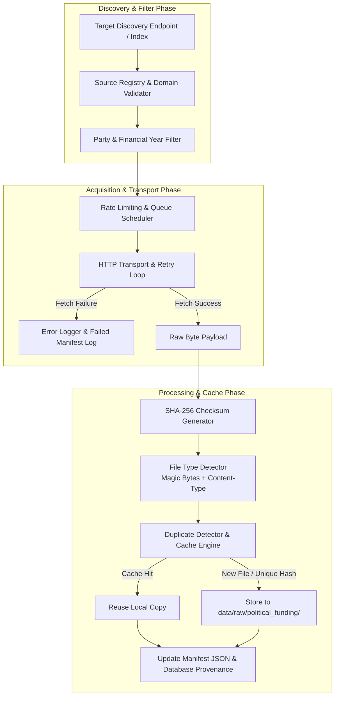

# Phase 5 — Financial Document Acquisition Framework Architecture

## 1. Overview & Objectives

Phase 5.2 establishes the **Reusable Financial Document Acquisition Framework** for CIVICLENS TN. The acquisition engine provides robust, polite, compliant, and configurable document discovery, downloading, format detection, checksum validation, caching, duplicate detection, and manifest tracking.

The pipeline is engineered to ingest raw statutory disclosures (Form 24A contribution reports, audited annual accounts, electoral trust reports, candidate election expenditure statements, and electoral bond releases) across multiple file formats including **PDF, HTML, CSV, XLSX, and JSON**.

> [!IMPORTANT]
> **Statutory Access & Non-Bypass Policy:** The acquisition system operates strictly on public statutory disclosures published by official bodies (ECI, SEC TN, ADR, SBI/SC releases). The engine strictly respects domain whitelists, rate limits, and site terms, and **never attempts to bypass authentication, access controls, or CAPTCHAs**.

---

## 2. Acquisition Pipeline Architecture



---

## 3. Core Engine Components

The acquisition engine implemented in [`backend/funding/acquisition.py`](file:///E:/CIVCLENS/backend/funding/acquisition.py) contains seven primary modules:

### 3.1 Source Registry (`SourceRegistry`)
Maintains official metadata endpoints for statutory financial documents:
- `SRC-ECI-24A`: ECI Form 24A Contribution Reports (`eci.gov.in`)
- `SRC-ECI-AUDIT`: ECI Annual Audited Accounts (`eci.gov.in`)
- `SRC-ECI-TRUSTS`: Electoral Trust Reports (`eci.gov.in`)
- `SRC-ADR-DONATIONS`: ADR Political Party Watch Donation Reports (`adrindia.org`)
- `SRC-SBI-BONDS`: SBI Electoral Bond Disclosures (`eci.gov.in` / `sbi.co.in`)
- `SRC-ECI-EXPENSE`: Party Election Expenditure Statements (`eci.gov.in`)

### 3.2 File Type Detector (`FileTypeDetector`)
Determines document formats through multi-tiered inspection:
1. **Magic Bytes Inspection:**
   - PDF: `b"%PDF"`
   - XLSX / ZIP: `b"PK\x03\x04"`
   - HTML: `b"<html"`, `b"<!doctype html"`
   - JSON: `b"{"` or `b"["` valid JSON parse
2. **Content-Type HTTP Header Analysis:** `application/pdf`, `text/html`, `text/csv`, `application/json`
3. **File Extension Fallback:** `.pdf`, `.html`, `.csv`, `.xlsx`, `.json`
4. **CSV Delimiter Heuristics:** Validates text lines containing comma separators.

### 3.3 Checksum & Caching Engine
- Computes SHA-256 digest (`sha256_hash`) for every acquired payload.
- Checks if the requested URL or SHA-256 hash already exists in `data/raw/political_funding/manifest.json`.
- If cached, returns local file reference without triggering redundant network downloads.

### 3.4 Duplicate Detection Mechanism
- Compares incoming SHA-256 hashes against all previously ingested document records.
- When an identical file content is retrieved from a different URL or secondary mirror:
  - Flags `is_duplicate = True`
  - Records `duplicate_of = <original_document_id>`
  - Maintains complete audit provenance without corrupting analytics.

### 3.5 Transport, Rate Limiting & Retry Loop
- **Rate Limit:** Enforces configurable inter-request delays (default: 1.0 second per domain).
- **Timeouts:** Configurable socket timeout (default: 15.0 seconds).
- **Retries:** Configurable retry attempts (default: 3 retries) using exponential backoff ($1.5^n$).
- **User Agent:** Identifies as `CIVICLENS-TN-Bot/1.0 (+https://civiclens.tn.gov.in/bot)`.

### 3.6 Filtering Engine (`AcquisitionConfig`)
Prevents indiscriminate scraping by applying configurable filters:
- **Party Filter:** Restricts processing to target Tamil Nadu parties (`DMK`, `AIADMK`, `INC`, `BJP`, `PMK`, `VCK`, `NTK`, `DMDK`).
- **Financial Year Filter:** Filters filings to specified reporting periods (e.g., `FY2020-21`, `FY2021-22`, `FY2022-23`).

---

## 4. Manifest Schema (`data/raw/political_funding/manifest.json`)

The acquisition manifest records complete document lineage, file metadata, checksums, and failure logs:

```json
{
  "manifest_version": "1.0",
  "created_at": "2026-10-10T16:54:19+00:00",
  "updated_at": "2026-10-10T16:56:12+00:00",
  "summary": {
    "total_documents": 2,
    "total_bytes": 1048576,
    "unique_sha256_hashes": 2,
    "duplicates_count": 0,
    "failed_downloads_count": 0
  },
  "documents": {
    "DOC_SRC-ECI-24A_DMK_FY2021-22_a3f9e12c": {
      "document_id": "DOC_SRC-ECI-24A_DMK_FY2021-22_a3f9e12c",
      "source_id": "SRC-ECI-24A",
      "source_name": "ECI Form 24A Contribution Disclosures",
      "source_url": "https://www.eci.gov.in/files/Form24A_DMK_2021-22.pdf",
      "party_code": "DMK",
      "financial_year": "FY2021-22",
      "retrieval_timestamp": "2026-10-10T16:55:00+00:00",
      "file_path": "data/raw/political_funding/SRC-ECI-24A/FY2021-22/DMK_FY2021-22_a3f9e12c.pdf",
      "file_size_bytes": 524288,
      "sha256_hash": "a3f9e12c...",
      "detected_format": "PDF",
      "is_duplicate": false,
      "duplicate_of": null,
      "status": "SUCCESS"
    }
  },
  "failed_downloads": []
}
```

---

## 5. Verification & Testing Strategy

The acquisition framework is thoroughly validated using local mock test fixtures in [`tests/unit/test_phase5_acquisition.py`](file:///E:/CIVCLENS/tests/unit/test_phase5_acquisition.py):

1. **Format Detection Tests:** Validates PDF, HTML, CSV, XLSX, and JSON magic byte parsing.
2. **Checksum Verification:** Asserts exact SHA-256 hash generation for mock payloads.
3. **Caching Tests:** Confirms that subsequent acquisition requests reuse existing local file paths.
4. **Duplicate Detection Tests:** Verifies that duplicate content hashes trigger `is_duplicate: True` and record `duplicate_of`.
5. **Rate Limiting Tests:** Verifies request spacing delays.
6. **Failed Download Tests:** Confirms retry exhaustion and failure logging in `manifest.json`.
7. **Filter Tests:** Verifies party code and financial year filtering rules.
