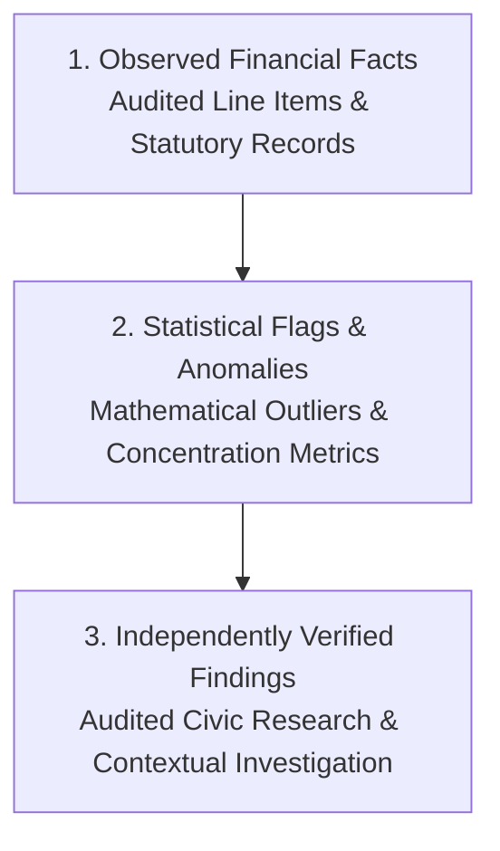

# Phase 5 — Political Funding Anomaly Detection Methodology & Ethical Framework

## 1. Ethical Interpretation & Neutrality Framework

### Core Principles

The primary purpose of the CIVICLENS TN Political Funding Transparency Analyzer is to provide rigorous, objective, quantitative tools for civic research and data-driven analysis.

> [!CAUTION]
> **Ethical Interpretation Directive:** A statistical anomaly, pattern flag, or disclosure gap identified by Phase 5 **DOES NOT prove corruption, illegality, favoritism, or a quid pro quo**. An anomaly represents a mathematical pattern or reporting irregularity that warrants examination by independent civic researchers, auditors, or journalists.

---

### Three-Tier Distinction Framework

Phase 5 strictly separates analytical findings into three distinct epistemological categories:

1. **Observed Financial Facts:**
   - Empirical data directly extracted from statutory filings or judicial disclosures.
   - *Example:* "Party A declared ₹15.2 Crore in Form 24A disclosures for FY 2021-22."
   - *Status:* Objective factual record with provenance back to source PDF.
2. **Statistical Flags & Anomaly Indicators:**
   - Mathematical outputs computed by statistical algorithms (Gini index, Benford's Law chi-square, threshold clustering ratios).
   - *Example:* "Party A exhibits a top-3 donor concentration index of 0.84, exceeding the state cohort mean by 2.3 standard deviations (Z = +2.3)."
   - *Status:* Neutral quantitative signal; contains no normative accusation.
3. **Independently Verified Findings:**
   - Contextual findings confirmed through independent audit, investigative journalism, or official regulatory enquiry.
   - *Example:* "An independent audit confirmed that Company X was registered 12 days prior to issuing an Electoral Trust donation of ₹5 Crore."
   - *Status:* Verified contextual intelligence.

---

## 2. Quantitative Analysis Objectives & Mathematical Models

Phase 5 defines 10 quantitative analysis objectives and their corresponding mathematical models:

### 2.1 Donation Concentration (Gini & HHI Index)

Measures the degree to which a party's disclosed donations are concentrated among a small number of large donors versus distributed across a broad base.

- **Gini Coefficient ($G$):**
  $$G = \frac{\sum_{i=1}^n \sum_{j=1}^n |x_i - x_j|}{2 n^2 \bar{x}}$$
  *Scale:* $0.0$ (perfect equality across donors) to $1.0$ (complete concentration in a single donor).

- **Herfindahl-Hirschman Index ($HHI$):**
  $$HHI = \sum_{i=1}^n \left(\frac{x_i}{X}\right)^2$$
  *Interpretation:* $HHI > 0.25$ indicates high concentration.

---

### 2.2 Donor Contribution Distribution

Categorizes incoming contribution volume across donor types:
$$\text{Corporate Share} = \frac{\sum \text{Amount}_{\text{Corporate}}}{\text{Total Disclosed Contributions}}$$
$$\text{Individual Share} = \frac{\sum \text{Amount}_{\text{Individual}}}{\text{Total Disclosed Contributions}}$$
$$\text{Electoral Trust Share} = \frac{\sum \text{Amount}_{\text{Trusts}}}{\text{Total Disclosed Contributions}}$$

---

### 2.3 Year-on-Year (YoY) Funding Changes & Election Spikes

Calculates annual percentage growth rates and isolates election-year surges against non-election baseline years:

$$\text{YoY Growth}_t = \frac{\text{Income}_t - \text{Income}_{t-1}}{\text{Income}_{t-1}} \times 100$$

$$\text{Election Surge Index} = \frac{\text{Income}_{\text{Election Year}}}{\frac{1}{3} \sum_{k=1}^3 \text{Income}_{\text{Non-Election Year}_k}}$$

---

### 2.4 Income and Expenditure Trends (Surplus / Deficit Intensity)

Evaluates financial sustainability and expenditure intensity during active election cycles:

$$\text{Surplus/Deficit Ratio} = \frac{\text{Total Income} - \text{Total Expenditure}}{\text{Total Income}}$$

$$\text{Campaign Expenditure Intensity} = \frac{\text{Declared Election Campaign Expenditure}}{\text{Total Annual Income}}$$

---

### 2.5 Disclosed Donor Concentration vs Undisclosed Sources

Measures the proportion of total party income coming from disclosed donors (> ₹20,000) versus un-itemized or anonymous sources (voluntary contributions < ₹20,000, electoral bonds, cash coupons):

$$\text{Disclosed Ratio} = \frac{\text{Form 24A Disclosed Total}}{\text{Total Audited Income}}$$

$$\text{Unknown Source Ratio} = 1.0 - \text{Disclosed Ratio}$$

*Threshold Flag:* Flagged when `Unknown Source Ratio > 0.75` for recognized parties.

---

### 2.6 Electoral Trust Flow Pass-Through Analysis

Tracks fund flows from corporate originators through Electoral Trusts to recipient political parties in Tamil Nadu:

$$\text{Trust Pass-Through Ratio} = \frac{\sum \text{Disbursements to TN Parties}}{\text{Total Trust Gross Receipts}}$$

Measures flow velocity and checks whether trust disbursements spike within 30 days prior to election notifications.

---

### 2.7 Election Expenditure Comparisons

Compares declared party-level campaign spending across elections (TN Assembly 2016, 2021 vs. Lok Sabha 2019, 2024) and categorizes expenditure heads:

$$\text{Media Share} = \frac{\text{Publicity Expenditure}}{\text{Total Election Expenditure}}$$
$$\text{Travel Share} = \frac{\text{Star Campaigner Travel Expenditure}}{\text{Total Election Expenditure}}$$

---

### 2.8 Unusual Financial Patterns (Benford's Law & Threshold Clustering)

#### A. Benford's Law First-Digit Analysis
Checks whether the leading non-zero digits of individual contribution amounts ($x \ge 20,000$) conform to Benford's Law distribution:

$$P(d) = \log_{10}\left(1 + \frac{1}{d}\right), \quad d \in \{1, 2, \dots, 9\}$$

Calculates Chi-Square goodness-of-fit statistic:
$$\chi^2 = \sum_{d=1}^9 \frac{(O_d - E_d)^2}{E_d}$$
Where $O_d$ is observed count and $E_d = N \cdot P(d)$ is expected count.
*Flag:* $\chi^2 > 15.51$ ($p < 0.05$, df=8) indicates significant deviation from natural monetary distribution.

#### B. Threshold Clustering Analysis
Identifies artificial transaction splitting immediately below statutory disclosure thresholds (e.g., transactions between ₹19,000 and ₹19,999 to avoid Form 24A disclosure):

$$\text{Threshold Clustering Index} = \frac{\text{Count}(\text{Txn} \in [19000, 19999])}{\text{Count}(\text{Txn} \in [10000, 18999]) / 0.9}$$

---

### 2.9 Missing or Inconsistent Disclosures

Detects discrepancy gaps between different statutory submissions for the same party and financial year:

$$\Delta_{\text{Discrepancy}} = |\text{Form 24A Total Above 20k} - \text{Audited Account Disclosed 20k Schedule}|$$

$$\text{Temporal Lag} = \text{Actual Submission Date} - \text{Statutory Filing Deadline Date (Days)}$$

---

### 2.10 Cross-Party Comparative Metrics (TN Cohort Standardized Z-Score)

Standardizes metrics across the cohort of Tamil Nadu political parties to enable fair comparison during identical reporting periods:

$$Z_{p, t} = \frac{M_{p, t} - \mu_t}{\sigma_t}$$

Where $M_{p, t}$ is party $p$'s metric in year $t$, $\mu_t$ is the mean metric across all contesting TN parties, and $\sigma_t$ is the standard deviation.

---

## 3. Anomaly Severity Classification

| Anomaly Type | Low Severity | Medium Severity | High Severity |
|---|---|---|---|
| **Concentration Spike** | Top-3 Donors share 50% - 65% | Top-3 Donors share 65% - 80% | Top-3 Donors share > 80% |
| **Benford's Law Deviation** | $\chi^2 \in [10.0, 15.5]$ | $\chi^2 \in (15.5, 25.0]$ | $\chi^2 > 25.0$ ($p < 0.001$) |
| **Threshold Clustering** | Clustering Index 1.5 - 2.5 | Clustering Index 2.5 - 5.0 | Clustering Index > 5.0 |
| **Disclosure Mismatch** | Discrepancy 1% - 5% | Discrepancy 5% - 15% | Discrepancy > 15% |
| **Filing Delay** | Delay 1 - 30 days | Delay 31 - 90 days | Delay > 90 days / Missing |
