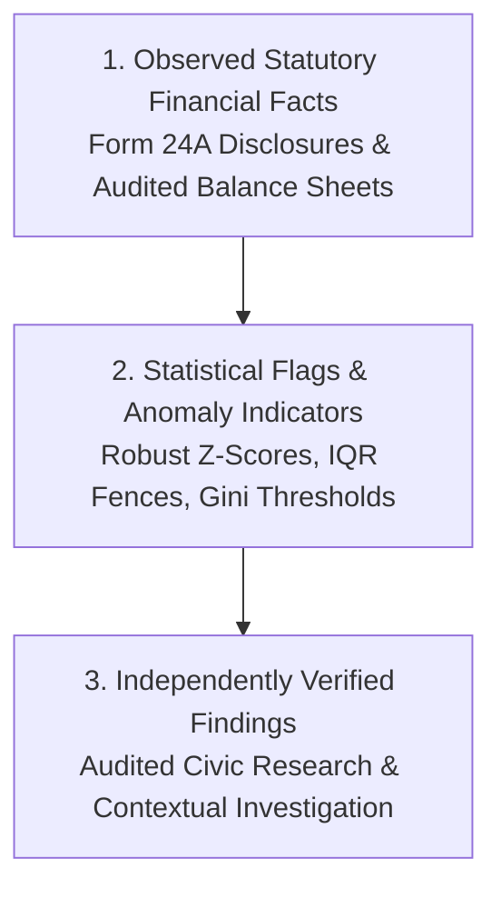

# Phase 5 — Political Funding Anomaly Detection Methodology & Ethical Framework

## 1. Executive Summary & Ethical Neutrality Framework

Phase 5.7 establishes the **Transparent Political Funding Anomaly Detection Engine** for CIVICLENS TN. The engine applies interpretable statistical methods to normalized financial disclosures and financial metrics to detect mathematical patterns, temporal spikes, donor concentrations, and disclosure discrepancies.

> [!CAUTION]
> **CRITICAL ETHICAL DIRECTIVE:**
> 1. An **anomaly score is NOT a probability of corruption**, and **DOES NOT prove corruption**, illegality, favoritism, or a quid pro quo.
> 2. The engine **NEVER automatically labels** any political party, donor, or candidate as corrupt or illegal in a criminal sense.
> 3. An anomaly flag represents an objective mathematical pattern that warrants independent examination by accredited civic researchers, auditors, or investigative journalists.

---

## 2. Three-Tier Epistemological Model

Phase 5 strictly separates analytical findings into three distinct levels of certainty:



1. **Observed Financial Facts:** Empirical line items directly extracted from statutory PDF/HTML filings.
   - *Example:* "DMK declared ₹50 Crore received from Prudent Electoral Trust in FY 2021-22."
2. **Statistical Flags & Anomaly Indicators:** Mathematical signals produced by statistical algorithms.
   - *Example:* "Party A exhibits a donor concentration Gini index of 0.84, exceeding the state cohort mean by 2.3 MAD standard deviations."
3. **Independently Verified Findings:** Contextual audit conclusions confirmed by independent accredited researchers.
   - *Example:* "An independent corporate audit confirmed Company X was incorporated 12 days prior to issuing a ₹5 Crore donation."

---

## 3. Transparent Statistical Detection Methods

Phase 5 employs methods selected specifically for sample size appropriateness and distribution skewness:

### A. Robust Z-Score (using Median Absolute Deviation - MAD)
Handles highly skewed financial distributions without being distorted by extreme outliers:

$$\text{MAD} = \text{median}(|x_i - \tilde{x}|)$$

$$\text{Robust Z}_i = 0.6745 \times \frac{x_i - \tilde{x}}{\text{MAD}}$$

*Flag Condition:* Robust Z $> 3.0$ indicates an extreme statistical outlier.

### B. Interquartile Range (IQR) Upper Fences
Provides non-parametric outlier boundaries:

$$\text{IQR} = Q_3 - Q_1$$
$$\text{Upper Fence} = Q_3 + 1.5 \times \text{IQR}$$

*Flag Condition:* Individual contribution amount $x > \text{Upper Fence}$.

### C. Year-on-Year Spike Thresholds
Detects annual contribution surges relative to baseline trends:

$$\text{YoY Growth} = \frac{\text{Income}_t - \text{Income}_{t-1}}{\text{Income}_{t-1}} \times 100$$

*Flag Condition:* $\text{YoY Growth} > 100\%$ AND $\text{YoY Growth} > 2.5 \times \text{Median Baseline Growth}$.

### D. Donor Concentration Thresholds
Measures dependency on a small number of donor entities:

$$G > 0.80 \quad \text{or} \quad HHI > 0.35$$

### E. Summary Discrepancy Gap Detector
Calculates discrepancy between itemized disclosures and audited summaries:

$$\Delta_{\text{Gap}} = |\text{Form 24A Extracted Sum} - \text{Audited Account Reported 20k Schedule}|$$

*Flag Condition:* $\Delta_{\text{Gap}} > \text{₹50,000}$.

### F. Isolation Forest (Cohort Sample Size $N \ge 10$)
Applied ONLY when sufficient comparable party/year observations exist ($N \ge 10$). Operates on feature vectors:
$$X_i = [\log_{10}(\text{Total Income}), \text{Gini Index}, \text{Unknown Source Ratio}, \text{YoY Growth}]$$

---

## 4. Potential Anomaly Flag Categories

| Flag Category | Detection Method | Mathematical Condition | Civic Review Rationale |
|---|---|---|---|
| `CONTRIBUTION_AMOUNT_OUTLIER` | Robust Z-Score / IQR | Robust Z $> 3.0$ or $> \text{Upper Fence}$ | Examine donor entity registration and corporate profile. |
| `YOY_CONTRIBUTION_SPIKE` | YoY Spike Threshold | Growth $> 100\%$ & $> 2.5\times \text{Median}$ | Verify election cycle timing and donor influx origins. |
| `HIGH_DONOR_CONCENTRATION` | Concentration Threshold | Gini $> 0.80$ or HHI $> 0.35$ | Assess party dependency on top corporate contributors. |
| `SUMMARY_DISCREPANCY_GAP` | Discrepancy Gap | Gap $> \text{₹50,000}$ | Check for un-itemized schedule pages or summary typos. |
| `MULTIVARIATE_FUNDING_OUTLIER` | Isolation Forest ($N \ge 10$) | Decision Score $< 0$ | Multi-variate divergence from cohort financial norms. |

---

## 5. Investigation Flag System & Review Lifecycle

Every detected pattern creates a structured flag object containing complete provenance, baseline metrics, and a human-readable explanation:

```json
{
  "anomaly_id": "ANOM_PARTY_TN_DMK_FY2021-22_CONCENTRATION",
  "party_id": "PARTY_TN_DMK",
  "financial_year": "FY2021-22",
  "metric_name": "HIGH_DONOR_CONCENTRATION",
  "observed_value": { "gini": 0.84, "hhi": 0.38 },
  "comparison_baseline": { "gini_threshold": 0.80, "hhi_threshold": 0.35 },
  "anomaly_score": 0.84,
  "detection_method": "DONOR_CONCENTRATION_THRESHOLD",
  "methodology_version": "v1.0",
  "source_document_ids": ["DOC_2021_DMK_24A"],
  "explanation": "Disclosed funding for PARTY_TN_DMK exhibits extreme donor concentration in FY2021-22 (Gini: 0.84, HHI: 0.38). Selected for civic review.",
  "review_status": "NEEDS_CIVIC_REVIEW",
  "flagged_at": "2026-10-10T17:25:00+00:00"
}
```

### Review Status Lifecycle
- `NEEDS_CIVIC_REVIEW`: Initial automated flag pending audit examination.
- `UNDER_AUDIT`: Active review by accredited civic researcher.
- `VERIFIED_EXPLAINABLE`: Confirmed explainable by legitimate election cycle event or statutory timing.
- `DISMISSED`: Determined to be false positive or data extraction artifact.

---

## 6. Verification Test Summary

The anomaly detection engine is verified in [`tests/unit/test_phase5_anomaly.py`](file:///E:/CIVCLENS/tests/unit/test_phase5_anomaly.py) using mock test fixtures in [`tests/fixtures/phase5_analytics_fixtures.py`](file:///E:/CIVCLENS/tests/fixtures/phase5_analytics_fixtures.py):

- **Robust Z-Score & Outlier Tests:** Verified detection of extreme contribution outliers.
- **YoY Growth Spike Tests:** Verified detection of YoY surges $> 100\%$.
- **Concentration Threshold Tests:** Verified detection of high Gini ($> 0.80$) and HHI ($> 0.35$).
- **Discrepancy Gap Tests:** Verified detection of gaps $> \text{₹50,000}$.
- **Isolation Forest Sample Size Test:** Verified that Isolation Forest is skipped when cohort $N < 10$, and executed when $N \ge 10$.
