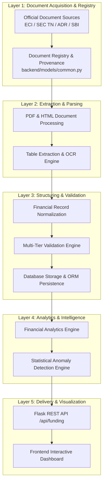
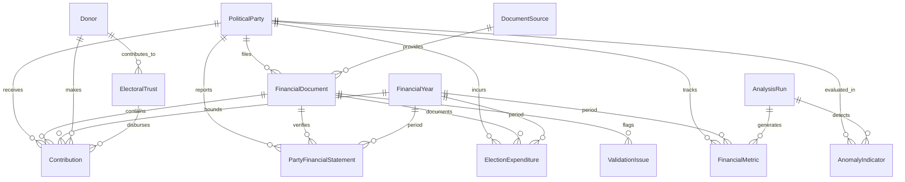

# Phase 5 — Political Funding Transparency & Anomaly Detection Architecture

## 1. Executive Summary & Objective

Phase 5 of **CIVICLENS TN** introduces the **Political Funding Transparency & Anomaly Detection Analyzer**. The objective is to establish an end-to-end analytical framework for ingesting, parsing, normalizing, validating, analyzing, and detecting structural patterns in political party funding, corporate and individual contributions, electoral trust disbursements, electoral bond disclosures, and election campaign expenditures.

The module focuses initially on political parties active in Tamil Nadu (including recognized state parties such as DMK, AIADMK, PMK, VCK, NTK, DMDK, as well as state units of national parties like INC and BJP), while fully supporting national party records when comparable statutory filings exist.

> [!IMPORTANT]
> **Data Integrity & Non-Fabrication Rule:** Phase 5 architecture is designed independently of live raw datasets. No real financial records are fabricated. All data pipeline components, entities, schemas, and anomaly algorithms operate against strictly validated statutory filings or explicitly labelled test fixtures.

---

## 2. System Pipeline Architecture

The Phase 5 pipeline enforces strict separation of concerns across nine sequential processing stages:

### Detailed Pipeline Stage Specifications

1. **Official Documents:** Raw statutory filings (Form 24A contribution disclosures, audited annual accounts, electoral trust reports, candidate/party election expenditure statements, SBI electoral bond disclosures).
2. **Document Registry:** Registration of incoming document metadata in `DocumentSource` and `FinancialDocument`, linked to `backend/models/common.py` (`Source` and `Document`) for full provenance and SHA-256 hash tracking.
3. **PDF/HTML Processing:** Automated layout analysis, page splitting, text extraction, and HTML table parsing.
4. **Table Extraction:** Structured tabular extraction using `pdfplumber` and `tabula-py`, with Tesseract OCR fallback for scanned non-searchable document pages.
5. **Financial Record Normalization:** Standardizing monetary figures to base units (INR/Rupees), financial year definitions (e.g., `2021-2022`), payment modes, and party name transliterations.
6. **Validation:** Executing double-entry verification checks, sum-check assertions, threshold checks, date-range bounds, and mandatory field integrity rules.
7. **Database Persistence:** Populating normalized records into SQLAlchemy ORM entities in `backend/models/funding.py`.
8. **Analytics Engine:** Computing financial metrics including donation concentration (Gini/HHI), corporate vs individual distribution, income-expenditure ratios, and electoral trust pass-through rates.
9. **Anomaly Detection Engine:** Applying statistical models (Benford's Law first-digit distribution, threshold clustering below ₹20,000, temporal spikes, and undisclosed funding ratio deviations).
10. **REST API:** Exposing structured endpoints under `/api/funding/` registered in `backend/api/routes.py`.
11. **Dashboard:** Rendering interactive visual analytics, party funding comparison views, trend lines, and transparent anomaly indicator cards.

---

## 3. Core Data Entities & Relationship Design

Phase 5 defines 13 primary data entities representing the political finance domain:

### Entity Specifications

1. **`PoliticalParty`**
   - *Description:* Master political party entity.
   - *Key Fields:* `party_id` (PK), `party_name`, `party_code` (e.g., `DMK`, `AIADMK`, `INC`), `party_type` (National, State Recognized TN, Unrecognized), `symbol`, `eci_registration_no`, `hq_state`.
   - *Integration:* Reused/extended from `backend/models/news.py` (`political_parties` table).

2. **`FinancialDocument`**
   - *Description:* Metadata for ingested financial filings.
   - *Key Fields:* `document_id` (PK), `source_id` (FK), `party_id` (FK), `financial_year_id` (FK), `filing_type` (Form24A, AnnualAudit, TrustReport, BondDisclosure, ElectionExpenditure), `file_path`, `file_hash_sha256`, `submission_date`, `page_count`, `ocr_applied`.
   - *Integration:* Foreign key linkage to `backend/models/common.py` `Document`.

3. **`DocumentSource`**
   - *Description:* Registry of document publication authorities.
   - *Key Fields:* `source_id` (PK), `source_name` (ECI, SEC_TN, ADR, SBI, SupremeCourt), `base_url`, `reliability_tier` (Tier 1 Statutory, Tier 2 Academic/NGO), `last_crawled_at`.

4. **`FinancialYear`**
   - *Description:* Financial year reference table.
   - *Key Fields:* `financial_year_id` (PK, e.g., `FY2021-22`), `year_label`, `start_date` (April 1), `end_date` (March 31), `is_election_year_tn` (Boolean).

5. **`Contribution`**
   - *Description:* Granular disclosed donation record (> ₹20,000 or disaggregated disclosures).
   - *Key Fields:* `contribution_id` (PK), `document_id` (FK), `party_id` (FK), `donor_id` (FK, nullable), `financial_year_id` (FK), `amount_inr` (Numeric), `payment_mode` (Cheque, DD, EFT, ElectoralBond, Cash, Unknown), `contribution_date`, `bank_details`, `pan_or_cin_provided` (Boolean), `raw_donor_name`.

6. **`Donor`**
   - *Description:* Entity profile for corporate entities, trusts, or individual donors.
   - *Key Fields:* `donor_id` (PK), `legal_name`, `normalized_name`, `donor_type` (Corporate, Individual, ElectoralTrust, Unknown), `cin_number`, `pan_hash`, `address`, `state`, `industry_sector`.
   - *Linking Rule:* Supports soft entity matching with confidence scores (`confidence_score` between 0.0 and 1.0). **Donor identity resolution is NEVER forced** when raw source data lacks explicit unique identifiers (like PAN or CIN).

7. **`ElectoralTrust`**
   - *Description:* Registered Electoral Trust profile.
   - *Key Fields:* `trust_id` (PK), `trust_name`, `registration_no`, `corporate_sponsor`, `approval_status`, `nodal_bank`.

8. **`PartyFinancialStatement`**
   - *Description:* Aggregated annual financial statement figures.
   - *Key Fields:* `statement_id` (PK), `party_id` (FK), `financial_year_id` (FK), `total_income`, `total_expenditure`, `net_surplus_deficit`, `grant_from_electoral_trusts`, `donations_above_20k`, `donations_below_20k`, `electoral_bond_income`, `other_income`, `auditor_name`, `audit_date`.

9. **`ElectionExpenditure`**
   - *Description:* Party election campaign expenditure statement details.
   - *Key Fields:* `expenditure_id` (PK), `party_id` (FK), `financial_year_id` (FK), `election_name` (e.g., `TN_Assembly_2021`), `publicity_expenditure`, `travel_expenditure_star_campaigners`, `other_expenditure`, `total_expenditure`.

10. **`FinancialMetric`**
    - *Description:* Precomputed statistical metrics per party per financial year.
    - *Key Fields:* `metric_id` (PK), `party_id` (FK), `financial_year_id` (FK), `gini_coefficient`, `hhi_index`, `disclosed_donor_ratio`, `corporate_ratio`, `yoy_income_growth`, `surplus_ratio`, `unknown_source_ratio`.

11. **`AnomalyIndicator`**
    - *Description:* Flagged financial anomaly or statistical outlier.
    - *Key Fields:* `anomaly_id` (PK), `party_id` (FK), `financial_year_id` (FK), `anomaly_type` (BenfordLawDeviation, ThresholdClustering, ConcentrationSpike, DisclosureMismatch, TemporalSpike), `severity` (Low, Medium, High), `z_score`, `divergence_metric`, `description`, `facts_json`.

12. **`ValidationIssue`**
    - *Description:* Quality check error or discrepancy detected during document parsing.
    - *Key Fields:* `issue_id` (PK), `document_id` (FK), `issue_type` (SumMismatch, MissingMandatoryField, OutOfBoundsDate, UnrecognizedParty), `severity` (Warning, Error), `details_json`.

13. **`AnalysisRun`**
    - *Description:* Immutable log of analytical execution runs.
    - *Key Fields:* `run_id` (PK), `executed_at`, `algorithm_version`, `parameters_json`, `records_processed`, `status`.

---

## 4. Integration with Existing Project Infrastructure

Phase 5 connects cleanly into the existing CIVICLENS TN architecture without duplicating or modifying Phase 1–4 capabilities:

1. **Database Core:**
   - Inherits `Base` from `backend.database.base_class`.
   - Reuses `backend/database/session.py` and Alembic migration structure.
   - Registered in `backend/database/base.py`.
2. **Data Provenance & Evidence Layer:**
   - Every `FinancialDocument` links directly to core `Document` (`backend/models/common.py`).
   - Every `Contribution` can be linked to `Evidence` records, allowing civic researchers to trace financial claims back to source PDF page numbers and SHA-256 file hashes.
3. **Cross-Phase Module Links:**
   - **Phase 1 & 2 (Budget):** Allows comparative analysis of party funding vs. state budget scheme allocations.
   - **Phase 3 (Promises):** Enables checking whether fulfilled political promises align with documented financial expenditures or donation timing.
   - **Phase 4 (News):** Connects media coverage volume of political parties during election cycles with party financial disclosures.
4. **API Router Integration:**
   - Endpoint blueprint mounted under `/api/funding` in `backend/api/routes.py`.
   - Uses standard JSON formatters from `backend/api/responses.py` and exception handlers from `backend/api/errors.py`.

---

## 5. Verification & Testing Architecture

All Phase 5 components are tested using **explicitly labelled test fixtures**:

- `tests/fixtures/phase5_fixtures.py`: Provides synthetic, mock financial disclosures and contribution records labelled strictly as test fixtures.
- `tests/unit/test_phase5_architecture.py`: Verifies entity relations, data validation logic, anomaly scoring algorithms, and dataset schema requirements.
- Zero fabrication rule: Real database sessions and production APIs operate only on verified statutory filings or explicitly mock test data in unit test environments.
