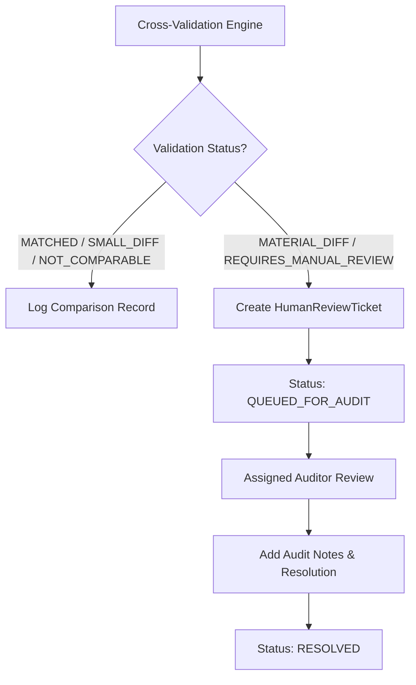

# Phase 5.8 — Financial Report Cross-Validation & Reconciliation System

## Executive Summary

The Phase 5.8 **Financial Report Cross-Validation System** provides automated cross-checks and reconciliation across statutory financial reports filed by political parties and electoral trusts with the Election Commission of India (ECI), alongside analytical data from the Association for Democratic Reforms (ADR).

A foundational mandate of CIVICLENS TN is **accounting rigor and legal context sensitivity**: financial documents filed under different statutory provisions possess distinct reporting windows, monetary thresholds, and accounting definitions. The system strictly distinguishes genuine numerical discrepancies from statutory scope differences, preventing false positive corruption flags.

---

## Statutory Document Types & Reporting Boundaries

| Document Type | Statutory Provision / Source | Scope / Window | Threshold / Disaggregation Level |
|---|---|---|---|
| **Form 24A (Contribution Report)** | Section 29C, Representation of the People Act, 1951 | Full Fiscal Year (12 months) | Discloses individual donations exceeding ₹20,000 |
| **Annual Audited Accounts** | ECI Guidelines & ICAI Guidance Note | Full Fiscal Year (12 months) | Total Gross Income (coupons, interest, bonds, small donations, schedule >20k) |
| **Electoral Trust Contribution Report** | Electoral Trusts Scheme, 2013 | Full Fiscal Year (12 months) | Itemized grants disbursed to registered political parties |
| **Election Expenditure Statement** | ECI Election Expenditure Monitoring Framework | 75-Day Election Campaign Period | Campaign spending incurred during election period |
| **ADR Analytical Reports** | Association for Democratic Reforms (NGO) | Independent analytical compilations | Digitized and cross-analyzed statutory disclosures |

---

## Domain Rules & Reconciliation Principles

### Rule 1: Form 24A vs Total Gross Income (Scope Rule)
- **Constraint:** Form 24A itemized contributions represent **only** donations $> \text{₹20,000}$. Total Audited Income includes electoral bonds, coupon sales, interest income, and un-itemized small donations ($\le \text{₹20,000}$).
- **Validation Logic:** Comparing Form 24A total against Total Audited Income must evaluate as `NOT_COMPARABLE` whenever $\text{Form 24A Total} \le \text{Total Audited Income}$.
- **Anomaly Exception:** If $\text{Form 24A Total} > \text{Total Audited Income}$, a statutory violation has occurred (itemized disclosures exceed total party income), resulting in `MATERIAL_DIFFERENCE`.

### Rule 2: Form 24A vs Audited Account >20k Schedule (Direct Match)
- **Constraint:** Both Form 24A and the Audited Account's Schedule for Contributions $> \text{₹20,000}$ share identical statutory coverage.
- **Validation Logic:** Direct numerical reconciliation.
  - Variance $< 1\% \implies$ `MATCHED`
  - Variance $1\% - 5\% \implies$ `SMALL_DIFFERENCE` (e.g., minor disaggregation or rounding)
  - Variance $5\% - 15\% \implies$ `MATERIAL_DIFFERENCE`
  - Variance $> 15\% \implies$ `REQUIRES_MANUAL_REVIEW`

### Rule 3: Election Campaign Expenditure vs Annual Audited Operating Expenditure (Window Rule)
- **Constraint:** Election expenditure reports cover spending during the 75-day campaign window. Annual Audit reports cover the entire 12-month operating year.
- **Validation Logic:** Evaluated as `NOT_COMPARABLE` when $\text{Campaign Expenditure} \le \text{Annual Operating Expenditure}$. If Campaign Expenditure exceeds Annual Operating Expenditure, it is flagged as `REQUIRES_MANUAL_REVIEW` due to potential accounting period overlap or misclassification.

### Rule 4: Electoral Trust Report vs Party Disclosure (Cross-Entity Reconciliation)
- **Constraint:** The payout reported by an Electoral Trust to Party X must equal the grant income reported by Party X from that Electoral Trust in Form 24A or Audited Schedules.
- **Validation Logic:** Cross-entity direct comparison. Minor timing gaps due to bank clearance dates are categorized under `SMALL_DIFFERENCE`.

---

## Discrepancy Taxonomy & Status Matrix

| Status Code | Description | Threshold / Condition | Action Required |
|---|---|---|---|
| `MATCHED` | Full numerical concordance | Variance $< 1.0\%$ | None |
| `SMALL_DIFFERENCE` | Minor variance | Variance $1.0\% - 5.0\%$ | Logged with auto-explanation |
| `MATERIAL_DIFFERENCE` | Material accounting discrepancy | Variance $5.0\% - 15.0\%$ | Generates Audit Ticket |
| `NOT_COMPARABLE` | Scope or timing boundary variance | Statutory scope difference | Explanatory note added |
| `REQUIRES_MANUAL_REVIEW` | Severe discrepancy or timing anomaly | Variance $> 15.0\%$ or Impossible state | Generates High-Priority Audit Ticket |

---

## Provenance & Traceability Schema

Every `ComparisonRecord` preserves full provenance references (`ProvenanceRef`) to source documents:

```json
{
  "comparison_id": "COMP_PARTY_TN_DMK_FY2021-22_24A_VS_AUDIT_20K",
  "party_id": "PARTY_TN_DMK",
  "financial_year": "FY2021-22",
  "source_document_a": "DOC_DMK_FORM24A_2021",
  "source_document_b": "DOC_DMK_AUDIT_2021",
  "metric_name": "CONTRIBUTIONS_ABOVE_20K_SCHEDULE",
  "value_a": 60130000.0,
  "value_b": 60130000.0,
  "difference": 0.0,
  "difference_percentage": 0.0,
  "difference_explanation": "Form 24A itemized sum matches Audited Account reported >20k schedule within 1% tolerance.",
  "validation_status": "MATCHED",
  "provenance_a": {
    "document_id": "DOC_DMK_FORM24A_2021",
    "source_name": "ECI Form 24A",
    "page_number": 12,
    "table_number": 1
  },
  "provenance_b": {
    "document_id": "DOC_DMK_AUDIT_2021",
    "source_name": "ECI Audit Accounts",
    "page_number": 4,
    "table_number": 2
  },
  "methodology_version": "v1.0"
}
```

---

## Human-Review Audit Workflow

Unresolved discrepancies (`MATERIAL_DIFFERENCE` and `REQUIRES_MANUAL_REVIEW`) automatically instantiate a `HumanReviewTicket` within `HumanReviewWorkflow`:



### Review Ticket Queue States
1. `QUEUED_FOR_AUDIT`: Ticket automatically logged; awaiting auditor assignment.
2. `IN_REVIEW`: Auditor actively reviewing statutory document pages.
3. `RESOLUTION_NOTES_ADDED`: Findings documented.
4. `RESOLVED`: Case closed with formal auditor justification.

---

## Policy on Misconduct Assumptions

> [!IMPORTANT]
> A numerical discrepancy or scope difference **does not constitute evidence of corruption or criminal non-compliance**. Discrepancies may arise from disaggregation methods, accounting timing differences, bank processing cutoffs, or document extraction boundaries. The system presents objective numerical facts and audit logs without speculative allegations.
