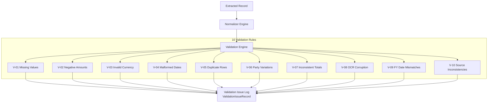

# Phase 5 — Financial Data Quality & Validation Report

## 1. Overview & Data Quality Strategy

Phase 5.4 establishes the **Financial Data Normalization and Validation Engine** for CIVICLENS TN. Extracted raw financial records (contributions, audited accounts, electoral trust payouts, and election campaign expenditure statements) are transformed into canonical data schemas and evaluated against ten automated data quality validation rules.

> [!IMPORTANT]
> **Strict Non-Merging Policy:** The normalization pipeline strictly enforces that donor names are **NOT automatically merged** merely because their spellings look similar. Differently named corporate or individual entities are preserved with their exact reported names to prevent false entity resolution. Raw source values are preserved alongside normalized values across all schemas.

---

## 2. Canonical Data Schemas

Extracted records are normalized into four canonical schemas defined in [`backend/schemas/funding.py`](file:///E:/CIVCLENS/backend/schemas/funding.py):

### A. Political Party Canonical Schema (`PoliticalPartySchema`)
- `party_id`: Canonical unique identifier (e.g., `PARTY_TN_DMK`, `PARTY_TN_AIADMK`).
- `official_name`: Full statutory legal name (e.g., `"Dravida Munnetra Kazhagam"`).
- `aliases`: List of alternate spellings/transliterations (`["DMK", "D.M.K.", "Dravida Munnetra Kazhagam"]`).
- `recognition_status`: `NATIONAL`, `STATE_RECOGNIZED_TN`, `UNRECOGNIZED_REGISTERED`.
- `valid_from` / `valid_to`: Registration validity window.
- `source_references`: Official gazette or registry citations.

### B. Contribution Canonical Schema (`ContributionSchema`)
- `contribution_id`: Unique record identifier.
- `party_id`: Link to canonical political party profile.
- `donor_name_as_reported`: Raw un-altered donor name as reported in source PDF.
- `donor_name_normalized`: Cleaned string for search indexing (preserving raw).
- `amount`: Float INR numeric amount (or `None`).
- `amount_status`: Value status (`VALID_NUMERIC`, `ZERO`, `MISSING`, `NOT_DISCLOSED`, `NOT_APPLICABLE`, `EXTRACTION_FAILURE`).
- `currency`: Default `"INR"`.
- `contribution_date_as_reported`: Raw transaction date string.
- `contribution_date_normalized`: Standardized ISO date (`YYYY-MM-DD`).
- `financial_year`: Standardized FY string (`FY2021-22`).
- `contribution_type`: Payment mode (`Cheque`, `DemandDraft`, `EFT_RTGS`, `ElectoralBond`, `Cash`, `ElectoralTrust`).
- `document_id` / `page_number` / `table_number`: Provenance markers.
- `original_row`: Full raw row text string.

### C. Financial Statement Canonical Schema (`FinancialStatementSchema`)
- `statement_id`: Unique statement identifier.
- `party_id`: Foreign key to canonical party profile.
- `financial_year`: Standardized FY string (`FY2021-22`).
- `income_categories`: Dict of line item income heads.
- `expenditure_categories`: Dict of line item expenditure heads.
- `assets_and_liabilities`: Dict of balance sheet figures.
- `total_income_reported` / `total_expenditure_reported` / `net_surplus_deficit`: Audited totals.
- `document_id`: Source document reference.

### D. Election Expenditure Canonical Schema (`ElectionExpenditureSchema`)
- `expenditure_id`: Unique expenditure statement identifier.
- `party_id`: Foreign key to canonical party profile.
- `election`: Target election (e.g. `"TN Legislative Assembly 2021"`).
- `reporting_period`: Financial year or election window.
- `expenditure_categories`: Itemized campaign spending heads.
- `reported_totals`: Reported gross election campaign expenditure.
- `document_id`: Source document reference.

---

## 3. Automated Validation Engine & 10 Validation Rules

The validation engine implemented in [`backend/funding/validator.py`](file:///E:/CIVCLENS/backend/funding/validator.py) executes 10 automated quality checks:

### Rule Specifications

| Rule Code | Rule Name | Description & Assertion | Severity | Suggested Remediation |
|---|---|---|---|---|
| `V-01` | Missing Values | Asserts required fields (`party_id`, `financial_year`, `raw_amount_str`) are populated. | `CRITICAL` | Review party alias mappings. |
| `V-02` | Negative Amounts | Asserts `amount >= 0` unless documented as refund note. | `CRITICAL` | Audit raw page for OCR minus artifact. |
| `V-03` | Invalid Currency Values | Flags unparseable monetary string (`amount_status == EXTRACTION_FAILURE`). | `CRITICAL` | Trigger manual OCR verification. |
| `V-04` | Malformed Dates | Flags unparseable date strings that cannot convert to ISO format. | `WARNING` | Standardize date format. |
| `V-05` | Duplicate Rows | Flags identical transaction rows appearing within same document page/table. | `WARNING` | Verify filing annexure duplicates. |
| `V-06` | Party Variations | Flags unrecognized party names (`party_id == PARTY_UNKNOWN`). | `CRITICAL` | Add new party alias to registry. |
| `V-07` | Inconsistent Totals | Asserts Form 24A itemized sum equals Audited Statement reported summary. | `WARNING` | Check for un-itemized schedules. |
| `V-08` | OCR Corruption | Flags rows with non-printable character artifacts or confidence $< 0.60$. | `WARNING` | Trigger high-res OCR fallback. |
| `V-09` | Financial Year Mismatches | Asserts transaction date falls within FY bounds (April 1 to March 31). | `WARNING` | Verify date typo or header FY. |
| `V-10` | Source Inconsistencies | Flags cases where Form 24A disclosed total exceeds total audited party income. | `CRITICAL` | Audit state vs central unit scope. |

---

## 4. Strict Donor Disambiguation Policy

To prevent false entity resolution:
1. **Raw Preservation:** `donor_name_as_reported` retains the exact character string from the source filing (e.g., `"Apex Infrastructure Pvt Ltd"`).
2. **No Merging Guarantee:** Donors with similar spellings (e.g. `"Apex Infrastructure Pvt Ltd"` vs `"Apex Infrastructure India Pvt Ltd"`) are treated as **distinct records**.
3. **Soft Disambiguation:** Soft matching scores are computed for research lookup without modifying canonical donor records.

---

## 5. Verification & Test Summary

The normalization and validation pipeline is tested in [`tests/unit/test_phase5_validation.py`](file:///E:/CIVCLENS/tests/unit/test_phase5_validation.py) using mock fixtures in [`tests/fixtures/phase5_validation_fixtures.py`](file:///E:/CIVCLENS/tests/fixtures/phase5_validation_fixtures.py):

- **Rule Verification:** All 10 validation rules tested against positive and negative test cases.
- **Non-Merging Verification:** Asserts distinct schema preservation for similar donor strings.
- **Cross-Source Consistency Verification:** Asserts detection of Form 24A vs Audited Account summary discrepancies.
