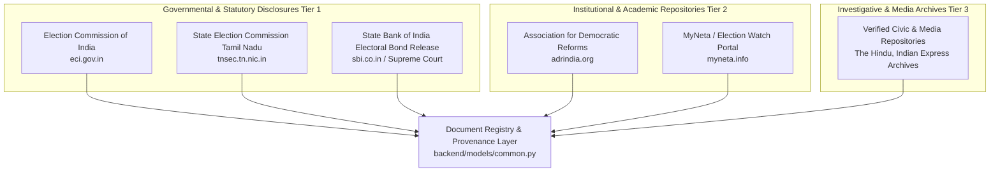
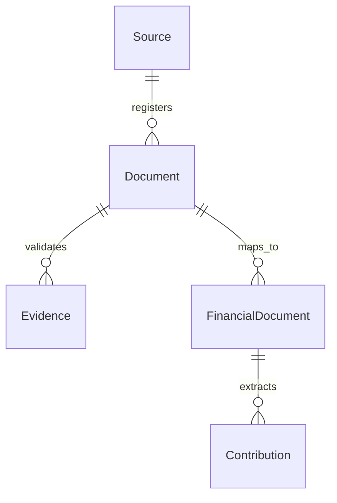

# Phase 5 — Data Sources, Archiving & Provenance Strategy

## 1. Source Inventory & Domain Taxonomy

Phase 5 acquires political finance data from verified governmental portals, statutory electoral bodies, non-governmental research institutions, and official judicial releases.

### Domain Taxonomy Matrix

| Source ID | Organization / Portal | Base Domain | Primary Content Types | Reliability Tier |
|---|---|---|---|---|
| `SRC-ECI-01` | Election Commission of India | `eci.gov.in` | Form 24A, Audit Reports, Trusts, Expenditure | **Tier 1** (Statutory 1.0) |
| `SRC-TNSEC-02` | TN State Election Commission | `tnsec.tn.nic.in` | Local body election spending disclosures | **Tier 1** (Statutory 1.0) |
| `SRC-SBI-03` | SBI / Supreme Court Release | `sbi.co.in` / ECI SC Portal | Electoral Bond Purchase & Redemption Logs | **Tier 1** (Judicial 1.0) |
| `SRC-ADR-04` | Association for Democratic Reforms | `adrindia.org` | Party donation analyses, trust research reports | **Tier 2** (Institutional 0.90) |
| `SRC-MYNETA-05` | MyNeta Election Watch | `myneta.info` | Candidate financial affidavits & summaries | **Tier 2** (Institutional 0.90) |
| `SRC-CIVIC-06` | Accredited Investigative Media | `thehindu.com`, `indianexpress.com` | Documented investigative funding reports | **Tier 3** (Media 0.75) |

---

## 2. Archiving & Storage Strategy

To ensure zero raw data alteration, complete reproducibility, and compliance with ethical crawling principles:

1. **Local Raw Document Storage:**
   - All ingested raw files (PDFs, HTML dumps, CSVs) are stored immutably in:
     `scratch/raw_funding_docs/<source_id>/<financial_year>/`
   - File naming convention:
     `<party_code>_<filing_type>_<financial_year>_<sha256_prefix8>.pdf`
     (Example: `DMK_Form24A_FY2021-22_a3f9e12c.pdf`)
2. **Cryptographic Hashing:**
   - Upon initial download, every raw document is assigned a unique `SHA-256` hash.
   - Re-downloading or re-parsing the document checks the SHA-256 hash against existing records in `FinancialDocument` to prevent duplicate ingestion.
3. **Robots.txt & Rate Limiting:**
   - Adheres to `robots.txt` specifications for all target domains.
   - Crawlers enforce a minimum inter-request delay of **2.0 seconds** with exponential backoff on retry (3 retries max).
   - Uses descriptive, transparent HTTP User-Agent header:
     `User-Agent: CIVICLENS-TN-Bot/1.0 (+https://civiclens.tn.gov.in/bot)`

---

## 3. Provenance & Audit Trail Integration

Phase 5 directly reuses and extends the core provenance model established in `backend/models/common.py`:

### Data Lineage Chain

- **Source Registration:** Every domain (e.g. `eci.gov.in`) is logged as a `Source` in `backend/models/common.py`.
- **Document Log:** Downloaded PDF filings create a `Document` record containing `url`, `content_hash`, `mime_type`, and `retrieved_at` timestamp.
- **Financial Document Mapper:** `FinancialDocument` references `Document.id`, adding domain-specific fields like `party_id`, `financial_year`, and `filing_type`.
- **Record-Level Lineage:** Every extracted `Contribution` or `PartyFinancialStatement` line item retains a `document_id` reference and page number marker, allowing any displayed number to be audited back to the exact page of the raw PDF.

---

## 4. Source Reliability Framework

Phase 5 evaluates data confidence using a 3-Tier Source Reliability Model:

- **Tier 1 (Confidence = 1.00): Statutory Government & Judicial Releases**
  - Official filings submitted directly to ECI, SEC TN, or mandated by Supreme Court rulings.
  - *Status:* Definitive statutory fact.
- **Tier 2 (Confidence = 0.90): Verified Non-Governmental & Academic Repositories**
  - Peer-reviewed research reports, ADR aggregated studies, MyNeta candidate disclosures.
  - *Status:* Highly reliable secondary aggregation; validated against Tier 1 where possible.
- **Tier 3 (Confidence = 0.75): Accredited Investigative Media & Civic Datasets**
  - Formally published investigative journalism reports analyzing political funding patterns.
  - *Status:* Contextual evidence; flagged as media-derived until backed by statutory filings.

---

## 5. Update Schedule & Monitoring

| Source Group | Ingestion Frequency | Data Lag Window | Monitoring Schedule |
|---|---|---|---|
| ECI Form 24A Reports | Quarterly Crawl | 3 - 6 Months post filing deadline | 1st of every month |
| ECI Annual Audit Reports | Bi-Monthly Crawl | 6 - 9 Months post financial year | 1st & 15th of every month |
| Electoral Trust Filings | Quarterly Crawl | 3 - 6 Months post financial year | 10th of every month |
| ADR Research Reports | Monthly Crawl | 1 - 2 Months post ADR publication | 5th of every month |
| Election Expenditure | Post-Election Sweep | 75 days post-election declaration | Weekly post election |
