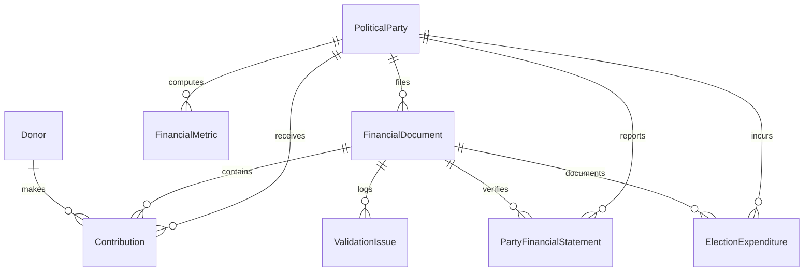

# Phase 5 — Political Funding Database Integration Report

## 1. Overview & Database Architecture

Phase 5.5 integrates normalized and validated political funding records into the central **CIVICLENS TN** database. The database integration layer ensures complete data provenance, source-document foreign key constraints, transaction-safe batch processing, idempotent re-import handling, duplicate reconciliation, and clear separation of reported statutory facts from computed analytical metrics.

> [!IMPORTANT]
> **Data Integrity Principles:**
> 1. **No Overwrite without Migration:** Existing raw or historical records are never overwritten without explicit database migration scripts.
> 2. **Fact vs. Metric Separation:** Reported statutory financial facts (Form 24A rows, audited balance sheet items) are stored strictly in `contributions` and `party_financial_statements`. Computed statistical analytics (Gini index, HHI, unknown source ratio) are stored separately in `financial_metrics`.
> 3. **Idempotence & Transaction Safety:** All batch imports use savepoints and explicit rollback handlers to prevent partial database corruption.

---

## 2. Relational Database Schema

The Phase 5 schema is implemented in [`backend/models/funding.py`](file:///E:/CIVCLENS/backend/models/funding.py) and registered in [`backend/database/base.py`](file:///E:/CIVCLENS/backend/database/base.py):



### Table Specifications

1. **`financial_documents`:** Master metadata table for ingested filings (`document_id`, `source_id`, `party_id`, `financial_year`, `filing_type`, `file_hash_sha256`, `source_url`, `page_count`, `is_scanned`).
2. **`donors`:** Entity profile for corporate and individual contributors (`donor_id`, `legal_name`, `normalized_name`, `donor_type`, `cin_number`, `pan_hash`).
3. **`electoral_trusts`:** Registered Electoral Trust registry (`trust_id`, `trust_name`, `registration_no`, `corporate_sponsor`).
4. **`contributions`:** Itemized donation transactions (`contribution_id`, `document_id`, `party_id`, `donor_id`, `financial_year`, `donor_name_as_reported`, `amount_inr`, `amount_status`, `contribution_date_normalized`, `page_number`, `original_row`).
5. **`party_financial_statements`:** Audited annual financial statements (`statement_id`, `party_id`, `financial_year`, `total_income`, `total_expenditure`, `net_surplus_deficit`, `income_categories_json`, `expenditure_categories_json`, `auditor_name`).
6. **`election_expenditures`:** Campaign expenditure filings (`expenditure_id`, `party_id`, `election_name`, `reporting_period`, `expenditure_categories_json`, `reported_totals`).
7. **`financial_metrics`:** Precomputed statistical analytics (`metric_id`, `party_id`, `financial_year`, `gini_coefficient`, `hhi_index`, `disclosed_donor_ratio`, `unknown_source_ratio`, `yoy_income_growth`).
8. **`funding_validation_issues`:** Audit log of data quality violations (`issue_id`, `rule_code`, `severity`, `entity_type`, `entity_id`, `field_name`, `description`, `raw_value`).

---

## 3. Database Import Pipeline Engine

Implemented in [`backend/repositories/funding.py`](file:///E:/CIVCLENS/backend/repositories/funding.py):

### A. Idempotent Import Handling
- Before inserting any record, the repository checks for existing primary keys or unique constraint pairs (e.g. `(party_id, financial_year)` for financial statements).
- If a record with matching key exists, the engine logs the record as `skipped_duplicates_count` without throwing primary key errors.

### B. Transaction-Safe Batch Execution
- Batch imports wrap database insertions inside nested savepoints (`db.begin_nested()`).
- If an unexpected database exception occurs during batch execution, `savepoint.rollback()` and `db.rollback()` reset the session, returning a structured failure summary without corrupting existing database state.

### C. Import Reconciliation Summary Logging
Every batch import returns a structured counter dictionary:
```json
{
  "total_submitted": 100,
  "inserted_count": 95,
  "skipped_duplicates_count": 5,
  "failed_count": 0,
  "errors": []
}
```

---

## 4. Migration & Schema Management

- **Migration File:** Created [`alembic/versions/phase5_funding_schema.py`](file:///E:/CIVCLENS/alembic/versions/phase5_funding_schema.py) chaining from revision `7ccfdea60b7f`.
- **Automatic Initialization:** Added Phase 5 models to `backend/database/base.py` enabling `Base.metadata.create_all(bind=engine)` for test and dev databases.

---

## 5. Verification & Test Summary

The database import pipeline is verified in [`tests/unit/test_phase5_database.py`](file:///E:/CIVCLENS/tests/unit/test_phase5_database.py) using SQLite in-memory databases:

- **Schema Creation Test:** Verified creation of all 8 Phase 5 database tables.
- **Idempotent Batch Import Test:** Verified that re-importing identical contribution batches skips duplicate records and returns accurate reconciliation metrics.
- **Foreign-Key Safety Test:** Verified foreign-key fallback handling when linking contributions to political parties.
- **Transaction Rollback Test:** Confirmed complete session rollback when database errors are injected into a batch transaction.
- **Fact vs. Metric Separation Test:** Confirmed that reported statutory facts and derived financial metrics are stored in separate tables.
