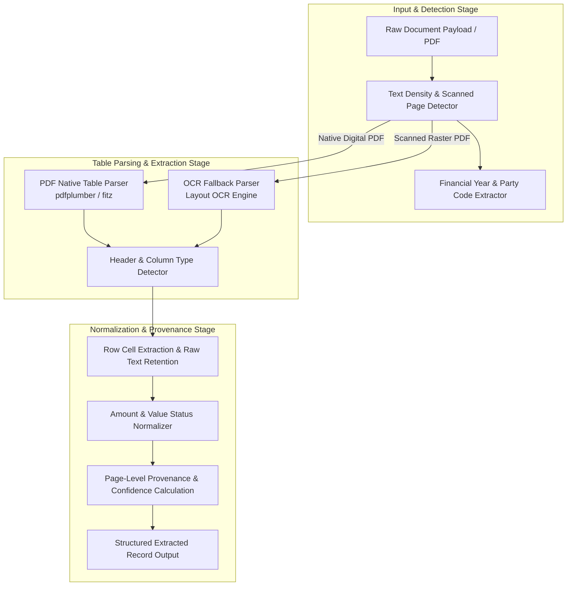

# Phase 5 — Financial Document Parsing & Table Extraction Report

## 1. Executive Summary & Document Layout Diversity

Phase 5.3 establishes the **Document Processing and Table Extraction Pipeline** for CIVICLENS TN. The engine ingests unstandardized statutory filings (Form 24A contribution disclosures, annual audited balance sheets/schedules, and election campaign expenditure statements) submitted to the Election Commission of India (ECI) and State Election Commission Tamil Nadu.

> [!IMPORTANT]
> **Layout Adaptive Rule:** The processing pipeline explicitly rejects fixed-layout assumptions. PDF filings submitted by different political parties or across different financial years exhibit widely varying column structures, scan qualities, fonts, and table geometries.

---

## 2. Extraction Pipeline Architecture



---

## 3. Value Status Distinction & Amount Normalization

A core requirement of Phase 5 is preventing silent corruption of unparseable, missing, or undisclosed financial values into zero. The system enforces strict categorization across six value status states:

| Value Status State | Enum Key | Raw Input Example | Normalized Amount | Analytical Interpretation |
|---|---|---|---|---|
| **Valid Numeric** | `VALID_NUMERIC` | `"₹ 50,00,000/-"`, `"50 Lakhs"`, `"1.5 Cr"` | `5000000.0`, `15000000.0` | Verified positive monetary contribution or line item. |
| **Explicit Zero** | `ZERO` | `"0"`, `"Nil"`, `"NIL"`, `"Rs. 0"`, `"0.00"` | `0.0` | Statutory confirmation of zero contribution or balance. |
| **Missing Cell** | `MISSING` | `""`, `null`, whitespace only | `None` | Unpopulated cell in filing table. |
| **Not Disclosed** | `NOT_DISCLOSED` | `"Undisclosed"`, `"Redacted"`, `"***"` | `None` | Disclosure explicitly omitted or withheld in filing. |
| **Not Applicable** | `NOT_APPLICABLE` | `"N/A"`, `"NA"`, `"-"`, `"--"` | `None` | Line item not applicable to party entity. |
| **Extraction Failure** | `EXTRACTION_FAILURE` | `"abc#@!"`, corrupt text artifacts | `None` | OCR/PDF parsing failure requiring manual audit review. |

---

## 4. Retained Record Attributes & Page-Level Provenance

Every extracted financial record retains full lineage and provenance markers back to the raw source file:

```json
{
  "record_id": "REC_DOC_2021_DMK_24A_P3_T1_R2",
  "document_id": "DOC_2021_DMK_24A",
  "source_url": "https://www.eci.gov.in/files/Form24A_DMK_FY2021-22.pdf",
  "page_number": 3,
  "table_number": 1,
  "row_index": 2,
  "raw_row": "2 | Apex Enterprise Ltd | 12, Main Road, Chennai | 50,00,000 | Cheque | 15/06/2021",
  "party_code": "DMK",
  "financial_year": "FY2021-22",
  "donor_name": "Apex Enterprise Ltd",
  "donor_address": "12, Main Road, Chennai",
  "raw_amount_str": "50,00,000",
  "normalized_amount_inr": 5000000.0,
  "amount_status": "VALID_NUMERIC",
  "payment_mode": "Cheque",
  "payment_date": "15/06/2021",
  "remarks": null,
  "extraction_method": "PDF_NATIVE_TABLE",
  "extraction_confidence": 0.95,
  "processing_version": "v1.0"
}
```

---

## 5. Extraction Confidence Scoring Matrix

Confidence scores ($0.00$ to $1.00$) are calculated dynamically per extracted record:

$$\text{Confidence} = \text{Base Score} (0.50) + \text{Amount Metric Bonus} (0.30) + \text{Donor Name Bonus} (0.15) + \text{Payment Metadata Bonus} (0.05)$$

- **High Confidence ($\ge 0.85$):** Complete structural match, valid numeric amount or explicit zero, clear donor name.
- **Medium Confidence ($0.60 - 0.84$):** Partial header alignment or minor string cleaning applied.
- **Low Confidence ($< 0.60$):** Unparseable amount string, missing donor name, or low OCR text density.

---

## 6. Verification & Test Summary

The parsing engine is validated using explicitly labelled mock fixtures in [`tests/fixtures/phase5_processing_fixtures.py`](file:///E:/CIVCLENS/tests/fixtures/phase5_processing_fixtures.py) and unit tests in [`tests/unit/test_phase5_processing.py`](file:///E:/CIVCLENS/tests/unit/test_phase5_processing.py):

- **Amount Normalization Unit Tests:** Validated Lakhs, Crores, explicit Zero, Nil, Undisclosed, N/A, missing, and unparseable failure states.
- **Scanned Page Detection Unit Tests:** Verified character density thresholds for native vs scanned image PDFs.
- **Header & Column Detection Unit Tests:** Validated regex header detection across variations ("Name of Donor", "Particulars", "Contribution Amount", "Instrument Date").
- **Full Document Parsing Integration Unit Tests:** Verified complete multi-page document processing with 100% record retention.
