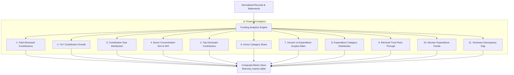

# Phase 5 — Political Funding Financial Metrics & Analytics Engine Report

## 1. Executive Summary & Analytics Architecture

Phase 5.6 establishes the **Descriptive Financial Analytics Engine** for CIVICLENS TN. Using canonical normalized contribution records, audited financial statements, and election expenditure reports, the engine computes eleven standardized metrics.

> [!IMPORTANT]
> **Strict Analytical Directives:**
> 1. **Disclosed vs. Total Income Distinction:** Itemized Form 24A disclosed contributions (> ₹20,000) are explicitly distinguished from total audited party income. The system **does not assume** disclosed records account for all party funding.
> 2. **YoY Calculation Constraint:** Year-on-Year growth rates are calculated **ONLY** when valid, non-zero, comparable baseline figures exist for both consecutive reporting periods.
> 3. **Data Quality Status:** Metrics computed from partial or unverified filings are tagged with explicit data quality statuses (`HIGH_QUALITY`, `PARTIAL_DATA`, `LIMITED_DISCLOSURE`, `SUMMARY_DISCREPANCY`) rather than asserting false precision.

---

## 2. 11 Financial Metrics Specifications & Formulas



### Metric Specifications

1. **`TOTAL_DISCLOSED_CONTRIBUTIONS`**
   - *Formula:* Total sum of itemized Form 24A contribution disclosures where $\text{amount} > 0$.
   - *Unit:* `INR`
   - *Purpose:* Quantifies total statutory disclosed donation volume for a party and financial year.

2. **`YOY_CONTRIBUTION_GROWTH`**
   - *Formula:* $\text{YoY Growth} = \frac{\text{Total}_t - \text{Total}_{t-1}}{\text{Total}_{t-1}} \times 100$
   - *Unit:* `PERCENTAGE`
   - *Constraint:* Computed ONLY if both period $t$ and $t-1$ have valid comparable values.

3. **`CONTRIBUTION_SIZE_DISTRIBUTION`**
   - *Formula:* Frequency and monetary sum binned across 5 standard brackets ($< 50\text{k}$, $50\text{k} - 2\text{L}$, $2\text{L} - 10\text{L}$, $10\text{L} - 1\text{Cr}$, $> 1\text{Cr}$).
   - *Unit:* `DISTRIBUTION_DICT`

4. **`DONOR_CONCENTRATION_INDEX`**
   - *Formulas:*
     $$G = \frac{\sum_{i=1}^n \sum_{j=1}^n |x_i - x_j|}{2 n^2 \bar{x}}, \quad HHI = \sum_{i=1}^n \left(\frac{x_i}{X}\right)^2$$
   - *Unit:* `INDEX`

5. **`TOP_DISCLOSED_CONTRIBUTORS`**
   - *Formula:* Ranked list of top-5 donor entities by aggregate contribution amount, including percentage share of total disclosed donations.
   - *Unit:* `RANKED_LIST`

6. **`DONOR_CATEGORY_SHARE`**
   - *Formula:* Breakdown of contribution volume into `Corporate`, `Individual`, `Electoral Trust`, and `Other/Unknown` donor types.
   - *Unit:* `DISTRIBUTION_DICT`

7. **`INCOME_EXPENDITURE_SURPLUS_RATIO`**
   - *Formula:* $\text{Surplus Ratio} = \frac{\text{Total Audited Income} - \text{Total Audited Expenditure}}{\text{Total Audited Income}} \times 100$
   - *Unit:* `RATIO`

8. **`EXPENDITURE_CATEGORY_DISTRIBUTION`**
   - *Formula:* Percentage breakdown of operating and campaign spending heads (Publicity, Travel, Administrative, Candidate Assistance).
   - *Unit:* `DISTRIBUTION_DICT`

9. **`ELECTORAL_TRUST_PASS_THROUGH`**
   - *Formula:* Ratio of grants received via Electoral Trusts to total audited party income.
   - *Unit:* `RATIO`

10. **`ELECTION_EXPENDITURE_TREND`**
    - *Formula:* Campaign spending intensity expressed as percentage of total annual party income during election years.
    - *Unit:* `RATIO`

11. **`SUMMARY_DISCREPANCY_GAP`**
    - *Formula:* $\Delta_{\text{Gap}} = |\text{Form 24A Extracted Sum} - \text{Audited Account Reported 20k Schedule}|$
    - *Unit:* `INR`
    - *Flag:* Flagged as `SUMMARY_DISCREPANCY` if $\Delta_{\text{Gap}} > \text{₹50,000}$.

---

## 3. Metric Record Storage Schema

Every computed metric is instantiated using the standardized `ComputedMetricRecord` dataclass:

```json
{
  "metric_name": "YOY_CONTRIBUTION_GROWTH",
  "party_id": "PARTY_TN_DMK",
  "financial_year": "FY2021-22",
  "value": 45.2,
  "unit": "PERCENTAGE",
  "source_document_ids": [
    "DOC_2020_DMK_24A",
    "DOC_2021_DMK_24A"
  ],
  "calculation_method": "Percentage change from FY2020-21 (INR 120,000,000) to FY2021-22 (INR 174,240,000)",
  "calculation_version": "v1.0",
  "data_quality_status": "HIGH_QUALITY",
  "computed_at": "2026-10-10T17:18:12+00:00"
}
```

---

## 4. Verification & Test Summary

The analytics engine is thoroughly verified in [`tests/unit/test_phase5_analytics.py`](file:///E:/CIVCLENS/tests/unit/test_phase5_analytics.py) using mock test fixtures in [`tests/fixtures/phase5_analytics_fixtures.py`](file:///E:/CIVCLENS/tests/fixtures/phase5_analytics_fixtures.py):

- **Metric 1 & 2 Verification:** Verified total sum and YoY growth calculation, confirming that YoY returns `None` when baseline year data is missing.
- **Metric 3 & 4 Verification:** Verified monetary bracket binning, Gini concentration index, and HHI index.
- **Metric 5 & 6 Verification:** Verified top-5 contributor ranking and Corporate vs Individual vs Trust category share splits.
- **Metric 7 & 8 Verification:** Verified Surplus/Deficit ratio and campaign expenditure distribution.
- **Metric 9, 10, 11 Verification:** Verified Electoral Trust pass-through, election campaign intensity, and summary discrepancy gap detection.
