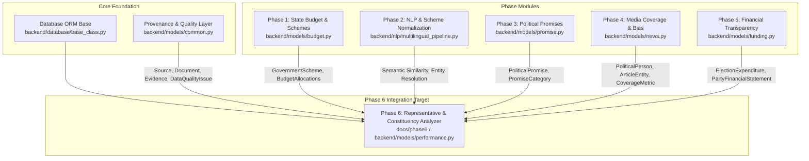
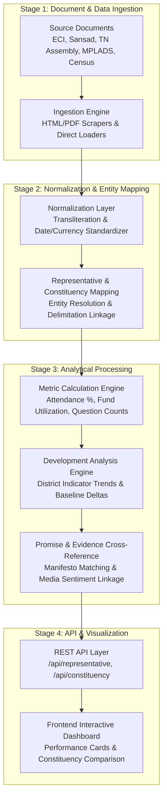
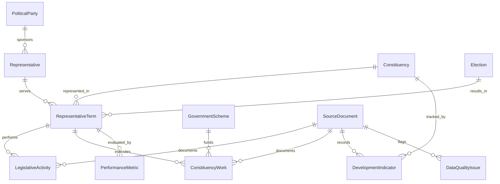

# Phase 6 — Public Representative Performance & Constituency Development Analyzer Architecture

## 1. Executive Summary & Objective

Phase 6 of **CIVICLENS TN** introduces the **Public Representative Performance & Constituency Development Analyzer**. The objective is to build an objective, data-driven analytical engine and pipeline for evaluating Members of the Legislative Assembly (MLAs in Tamil Nadu Assembly) and Members of Parliament (MPs in Lok Sabha and Rajya Sabha representing Tamil Nadu).

The analyzer consolidates data across multiple civic and developmental dimensions:
1. **Legislative Activity & Participation:** Debates, questions (starred/unstarred), private member bills, and attendance.
2. **Constituency Expenditure & Works:** Allocation, release, and spending of Local Area Development funds (MPLADS and MLACDS) alongside physical asset creation.
3. **Developmental Progress:** Socioeconomic indicators (literacy, health, electrification, water, infrastructure) across Tamil Nadu districts and constituencies.
4. **Promise & Media Cross-Referencing:** Aligning representative activity and constituency fund deployment with party manifestos (Phase 3), media coverage and sentiment (Phase 4), and financial disclosures (Phase 5).

> [!IMPORTANT]
> **Data Integrity & Non-Fabrication Rule:** Phase 6 architecture and data plans are established prior to real dataset acquisition. No dummy data is fabricated as real. All schemas, entities, pipeline stages, and analytical formulas operate strictly against verified statutory filings or explicitly labelled test fixtures (`tests/fixtures/phase6_fixtures.py`).

---

## 2. Integration with Existing Repository Infrastructure (Phases 1–5 Audit)

Phase 6 reuses and extends existing CIVICLENS TN components without rebuilding or duplicating existing modules:

### Infrastructure Audit & Component Reuse Map:
- **`backend/models/common.py` (Provenance & Audit):** Every Phase 6 source document registers as a `Source` and `Document`. Extracted claims link to `Evidence`. Analytical model outputs track `ModelPrediction`. Data anomalies use `DataQualityIssue`.
- **`backend/models/news.py` (Entities & Media):** Reuses `PoliticalPerson` and `PoliticalParty` entities to maintain unified entity IDs. Integrates with `ArticleEntity` and `CoverageMetric` to calculate constituency issue coverage.
- **`backend/models/budget.py` (Schemes & Budget):** Connects state-level budget allocations (`BudgetRecord`, `HistoricalScheme`) to local constituency scheme implementations (`GovernmentScheme`).
- **`backend/models/promise.py` (Promises):** Evaluates representative legislative focus against political party manifesto promises (`PoliticalPromise`).
- **`backend/models/funding.py` (Finances):** Cross-references representative election campaign spending (`ElectionExpenditure`) with post-election constituency fund deployment.
- **API Router & Repository Architecture:** Follows established repository pattern (`backend/repositories/`), Pydantic schemas (`backend/schemas/`), and REST API registration (`backend/api/routes.py`).

---

## 3. System Pipeline Architecture

The Phase 6 processing engine executes an 8-stage pipeline from raw source acquisition to interactive dashboard rendering:

### Pipeline Stage Functional Specifications

1. **Source Documents:** Ingestion of statutory election returns, parliamentary Hansard/questions XML/HTML, TN Legislative Assembly debate PDFs, MPLADS/MLACDS expenditure statements, and district statistical handbooks.
2. **Ingestion Engine:** Automated download pipelines with rate limiting, retries, SHA-256 document hashing, and registration in `SourceDocument`.
3. **Normalization Layer:** Cleans monetary amounts, standardizes parliamentary term dates, resolves bilingual representative names (English/Tamil), and categorizes activity codes.
4. **Representative/Constituency Mapping:** Links elected individuals to their specific constituency (`Constituency`), party (`PoliticalParty`), term (`RepresentativeTerm`), and delimitation period (2008 Delimitation order).
5. **Metric Calculation Engine:** Computes quantitative metrics across legislative participation, questions asked, and fund utilization rates.
6. **Development Analysis Engine:** Evaluates district/constituency socioeconomic progress against baseline census data (2011) and modern state statistical reports.
7. **Promise Cross-Reference:** Matches parliamentary questions and speeches with manifesto promise items using Phase 2 NLP vector similarity.
8. **REST API & Dashboard:** Exposes structured JSON endpoints under `/api/representative/` and `/api/constituency/` for consumption by the React/Vue/Streamlit frontend.

---

## 4. Core Data Entities & Relationship Design

Phase 6 defines 12 core entities representing the domain of public representative performance:

### Core Entity Field Specifications

#### 1. `Representative`
- **Description:** Master identity record for an elected representative (MLA or MP).
- **Key Fields:** `representative_id` (PK, e.g., `REP-TN-042`), `person_id` (FK to `PoliticalPerson`), `full_name_en`, `full_name_ta`, `date_of_birth`, `gender`, `educational_qualification`, `profession`, `permanent_address`, `created_at`.

#### 2. `PoliticalParty`
- **Description:** Master political party entity (reused from `backend/models/news.py`).
- **Key Fields:** `party_id` (PK), `party_name`, `party_code` (e.g., `DMK`, `AIADMK`, `INC`, `BJP`), `symbol`, `eci_registration_no`.

#### 3. `Constituency`
- **Description:** State Assembly or Parliamentary electoral constituency in Tamil Nadu.
- **Key Fields:** `constituency_id` (PK, e.g., `AC-115` or `PC-39`), `constituency_name_en`, `constituency_name_ta`, `constituency_type` (`ASSEMBLY` / `PARLIAMENTARY`), `constituency_number`, `district_name`, `reservation_status` (`GENERAL`, `SC`, `ST`), `delimitation_year` (e.g., `2008`), `total_electors`, `geometry_geojson`.

#### 4. `Election`
- **Description:** Specific election event.
- **Key Fields:** `election_id` (PK), `election_name` (e.g., `TN_Assembly_2021`, `LokSabha_2024`), `election_type` (`STATE_ASSEMBLY`, `LOK_SABHA`, `RAJYA_SABHA`), `election_year`, `poll_date`, `counting_date`, `total_voter_turnout_percent`.

#### 5. `RepresentativeTerm`
- **Description:** A representative's tenure representing a specific constituency during an election cycle.
- **Key Fields:** `term_id` (PK), `representative_id` (FK), `constituency_id` (FK), `election_id` (FK), `party_id` (FK), `house_type` (`TN_ASSEMBLY`, `LOK_SABHA`, `RAJYA_SABHA`), `start_date`, `end_date`, `is_active_term` (Boolean), `votes_polled`, `win_margin_votes`, `win_margin_percent`.

#### 6. `LegislativeActivity`
- **Description:** Itemized record of representative parliamentary or assembly activity.
- **Key Fields:** `activity_id` (PK), `term_id` (FK), `activity_type` (`QUESTION_STARRED`, `QUESTION_UNSTARRED`, `DEBATE_PARTICIPATION`, `PRIVATE_MEMBER_BILL`, `ATTENDANCE_SESSION`), `session_number`, `activity_date`, `title_subject`, `text_content`, `ministry_target`, `language_used` (`ta`, `en`, `hi`), `source_doc_id` (FK).

#### 7. `ConstituencyWork`
- **Description:** Project executed under local area development funds (MPLADS / MLACDS).
- **Key Fields:** `work_id` (PK), `term_id` (FK), `constituency_id` (FK), `scheme_id` (FK to `GovernmentScheme`), `work_name`, `work_category` (`EDUCATION`, `HEALTH`, `ROADS`, `WATER`, `SANITATION`, `ELECTRIFICATION`), `sanctioned_amount_inr`, `expenditure_inr`, `sanction_date`, `completion_date`, `status` (`PROPOSED`, `SANCTIONED`, `IN_PROGRESS`, `COMPLETED`, `CANCELLED`), `executing_agency`, `source_doc_id` (FK).

#### 8. `DevelopmentIndicator`
- **Description:** Socioeconomic metric tracked at district or constituency level over time.
- **Key Fields:** `indicator_id` (PK), `constituency_id` (FK), `district_name`, `indicator_code` (e.g., `LITERACY_RATE`, `INFANT_MORTALITY`, `TAP_WATER_COVERAGE`, `ROADS_KM`), `indicator_category` (`EDUCATION`, `HEALTH`, `INFRASTRUCTURE`, `WATER`), `value`, `unit_of_measurement`, `reference_year`, `source_doc_id` (FK).

#### 9. `GovernmentScheme`
- **Description:** State or central scheme funding constituency projects (reused/extended from `backend/models/budget.py`).
- **Key Fields:** `scheme_id` (PK), `scheme_name_en`, `scheme_name_ta`, `funding_type` (`MPLADS`, `MLACDS`, `STATE_BUDGET`, `CENTRAL_SPONSORED`), `department_id` (FK).

#### 10. `PerformanceMetric`
- **Description:** Aggregated, normalized performance score across dimensions.
- **Key Fields:** `metric_id` (PK), `term_id` (FK), `dimension` (`LEGISLATIVE_PARTICIPATION`, `QUESTIONS_DEBATES`, `CONSTITUENCY_WORKS`, `EXPENDITURE_EFFICIENCY`, `DEVELOPMENT_PROGRESS`, `PROMISE_ALIGNMENT`, `MEDIA_COVERAGE`, `DATA_COMPLETENESS`), `score_raw`, `score_normalized` (0.0 to 100.0), `percentile_rank`, `calculation_timestamp`, `methodology_version`.

#### 11. `SourceDocument`
- **Description:** Metadata for raw ingested documents (linked to `backend/models/common.py` `Document`).
- **Key Fields:** `source_doc_id` (PK), `document_type` (`ECI_RETURN`, `HANSARD_XML`, `TN_ASSEMBLY_PDF`, `MPLADS_CSV`, `CENSUS_REPORT`), `source_url`, `file_hash_sha256`, `ingested_at`, `publication_date`, `processing_status`.

#### 12. `DataQualityIssue`
- **Description:** Quality audit flags, missing fields, or data anomalies.
- **Key Fields:** `issue_id` (PK), `source_doc_id` (FK), `entity_type`, `entity_id`, `issue_type` (`MISSING_ATTENDANCE`, `UNMATCHED_CONSTITUENCY`, `EXPENDITURE_DISCREPANCY`, `OUT_OF_BOUNDS_METRIC`), `severity` (`LOW`, `MEDIUM`, `HIGH`, `CRITICAL`), `description_text`, `resolved` (Boolean).

---

## 5. Performance Dimensions & 4-Tier Metric Distinction

Phase 6 strictly categorizes metrics across four levels of the outcome hierarchy:

| Level | Definition | Example Metrics |
|---|---|---|
| **Level 1: Activity** | Operational actions taken by the representative. | Session attendance %, number of questions asked, debates participated, private member bills introduced. |
| **Level 2: Expenditure** | Financial deployment of public development funds. | MPLADS / MLACDS fund allocation, released funds, sanctioned funds, unspent balance ratio. |
| **Level 3: Outputs** | Physical assets and direct deliverables created. | Kilometers of roads constructed, school classrooms built, overhead water tanks erected, primary health centers upgraded. |
| **Level 4: Actual Outcomes** | Tangible long-term socioeconomic impact in the constituency. | Increase in district literacy rate, reduction in infant mortality rate, expansion of household piped water access, increase in groundwater table level. |

---

## 6. Verification & Data Quality Framework

1. **Non-Fabrication Policy:** All development and testing use explicitly labelled fixtures (`tests/fixtures/phase6_fixtures.py`).
2. **Provenance Traceability:** Every `PerformanceMetric` links back through `SourceDocument` to `Evidence` (`backend/models/common.py`), capturing page numbers and document hashes.
3. **Data Completeness Index:** If data is missing for a representative or period, the system calculates a `Data Completeness Score` rather than imputing missing values.
