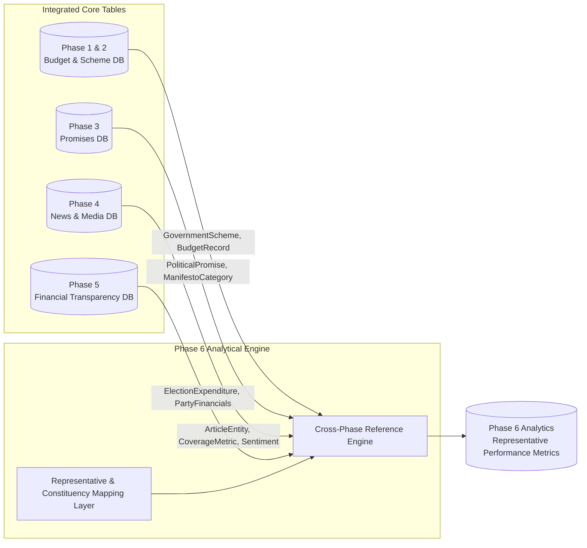

# Phase 6 — Representative Performance & Constituency Data Sources Inventory & Access Protocols

## 1. Data Ecosystem Overview

Phase 6 of **CIVICLENS TN** integrates public government portals, statutory election archives, parliamentary repositories, census datasets, and cross-phase CIVICLENS TN data tables.

This document details the technical specifications, access protocols, rate limits, parsing strategies, and data quality controls for all primary and secondary data sources.

---

## 2. Technical Source Inventory & Access Protocols

### 2.1 Election Commission of India (ECI) Official Portals
- **Base URLs:**
  - Main Portal: [https://www.eci.gov.in/](https://www.eci.gov.in/)
  - Election Results Portal: [https://results.eci.gov.in/](https://results.eci.gov.in/)
- **Data Provided:** State Assembly & Lok Sabha election statistical returns, candidate affidavits (Form 26), constituency voter turnouts, win margins, reserved seat classifications.
- **Technical Access Protocol:**
  - Protocol: HTTPS GET
  - User-Agent Requirement: Standard browser string (e.g. `Mozilla/5.0 (Windows NT 10.0; Win64; x64)`)
  - Rate Limit / Polling Delay: 2.0 seconds between requests
  - Expected Response Types: HTML tables, downloadable PDF reports, static JSON result feeds during active counting.
- **Parsing & Ingestion Strategy:**
  - HTML parsing via `BeautifulSoup4` for election result summary tables.
  - Candidate affidavit PDF table extraction via `pdfplumber`.
- **Data Quality & Risk Mitigation:**
  - *Risk:* Dynamic URL structures change between election years.
  - *Mitigation:* Store canonical local copies in `data/raw/phase6/eci/` with SHA-256 hash logging in `SourceDocument`.

---

### 2.2 Parliament of India Digital Portal (Sansad)
- **Base URL:** [https://sansad.in/](https://sansad.in/)
- **Data Provided:** Lok Sabha & Rajya Sabha MP activity logs, attendance records, questions asked (starred/unstarred), debates participated, private member bills introduced.
- **Technical Access Protocol:**
  - Protocol: HTTPS REST / Web Scraping
  - Rate Limit / Polling Delay: 3.0 seconds per request
  - Access Restriction: Portal enforces Cloudflare rate limiting and JavaScript challenge checks on automated sessions.
- **Parsing & Ingestion Strategy:**
  - Use headless browser or session-maintained HTTP clients with retry middleware.
  - Extract structured question metadata (subject, ministry, question text, answer text).
- **Data Quality & Risk Mitigation:**
  - *Risk:* Question text formatting varies across different ministries.
  - *Mitigation:* Apply standard regex cleaners to normalize question titles and response bodies.

---

### 2.3 PRS Legislative Research Portal
- **Base URL:** [https://prsindia.org/](https://prsindia.org/)
- **Data Provided:** Independent academic compilation of MP performance indicators (national and state average comparisons for attendance, questions, debates, and private member bills).
- **Technical Access Protocol:**
  - Protocol: HTTPS GET
  - Rate Limit / Polling Delay: 2.0 seconds per request
  - Format: HTML pages, downloadable CSV summary files.
- **Parsing & Ingestion Strategy:**
  - Direct CSV download where available.
  - Web scraping of MP profile pages for verified attendance and debate metrics.
- **Data Quality & Risk Mitigation:**
  - *Risk:* PRS compiles MP data primarily for Parliament (Lok Sabha/Rajya Sabha); State Assembly MLA data coverage is limited.
  - *Mitigation:* Use PRS as Tier-1 verification for MPs, while relying on TNLA official transcripts for MLAs.

---

### 2.4 Tamil Nadu Legislative Assembly Secretariat (TNLA)
- **Base URL:** [https://www.assembly.tn.gov.in/](https://www.assembly.tn.gov.in/)
- **Data Provided:** Official TN Legislative Assembly proceedings, debate transcripts (Hansard), Question Hour Q&A PDF releases, MLA profile directory, committee assignments.
- **Technical Access Protocol:**
  - Protocol: HTTPS GET
  - Format: PDF documents published in Tamil (`ta`) and English (`en`).
  - Rate Limit / Polling Delay: 1.5 seconds per request.
- **Parsing & Ingestion Strategy:**
  - PDF document processing pipeline (`pdfplumber` + Tesseract OCR fallback for scanned pages).
  - Tamil language NLP text segmentation to split daily proceedings into individual MLA speeches and questions.
- **Data Quality & Risk Mitigation:**
  - *Risk:* Scanned older assembly debate PDFs contain optical noise or low clarity.
  - *Mitigation:* Log extraction confidence scores in `SourceDocument` and flag low-confidence pages in `DataQualityIssue`.

---

### 2.5 MPLADS & MLACDS Portals
- **Base URL:** [https://mplads.gov.in/](https://mplads.gov.in/) & TN Rural Development Department MLACDS Portal
- **Data Provided:** MPLADS/MLACDS fund releases, sanctioned amounts, unspent balances, itemized project recommendations, asset execution status.
- **Technical Access Protocol:**
  - Protocol: HTTPS GET / Session Form Submissions
  - Format: Dynamic HTML reports, downloadable Excel/CSV releases.
  - Rate Limit / Polling Delay: 2.5 seconds per request.
- **Parsing & Ingestion Strategy:**
  - Automated session handling to navigate constituency selection dropdowns.
  - Table extraction engine to parse project status (`SANCTIONED`, `IN_PROGRESS`, `COMPLETED`, `CANCELLED`).
- **Data Quality & Risk Mitigation:**
  - *Risk:* Project completion dates are occasionally updated with delay by local district authorities.
  - *Mitigation:* Maintain historical snapshots in `backend/models/common.py` `DataSource` to track status updates over time.

---

### 2.6 Tamil Nadu Finance Department (State Budget Portal)
- **Base URL:** [https://www.tnbudget.tn.gov.in/](https://www.tnbudget.tn.gov.in/)
- **Data Provided:** Tamil Nadu Annual Budget documents, Detailed Demands for Grants, scheme allocations across departments, outcome budget targets.
- **Technical Access Protocol:** Integrated via Phase 1 State Budget module (`backend/models/budget.py`).
- **Format:** PDF Budget Statements & Cleaned SQL Database Records.
- **Parsing & Ingestion Strategy:** Reuses existing Phase 1 `BudgetIngestor` and `BudgetRecord` repositories.

---

### 2.7 Census of India & Open Government Data (Data.gov.in)
- **Base URLs:**
  - Census India: [https://censusindia.gov.in/](https://censusindia.gov.in/)
  - Data.gov.in: [https://www.data.gov.in/](https://www.data.gov.in/)
- **Data Provided:** Census 2011 demographic data, rural/urban population breakdown, SC/ST percentages, literacy rate baselines, district development indicators, open government statistics.
- **Technical Access Protocol:**
  - Protocol: HTTPS GET / OGD API JSON endpoints.
  - Format: CSV, XLSX, JSON.
  - API Key: Optional for OGD API downloads.
- **Parsing & Ingestion Strategy:** Direct CSV/Excel structured loading into `DevelopmentIndicator` and `Constituency` master tables.

---

## 3. Cross-Phase Data Integration Architecture

Phase 6 seamlessly integrates datasets established in earlier CIVICLENS TN phases:

---

## 4. Data Quality & Audit Infrastructure

All Phase 6 data ingestion pipelines enforce four automated quality controls:

1. **SHA-256 Provenance Logging:** Every raw file ingested from an external URL is hashed and logged in `backend/models/common.py` `Document`.
2. **Double-Entry Validation:** Fund release figures (`Released = Sanctioned + Unspent Balance`) and vote counts (`Total Polled = Candidate Votes Sum + NOTA + Rejected`) are mathematically verified upon ingestion.
3. **Data Quality Issue Registration:** Any record with missing mandatory fields, invalid dates, or unmatched constituency codes triggers an immutable entry in `DataQualityIssue`.
4. **Non-Fabrication Policy:** Where official source data is absent, the field remains `NULL` with a recorded `DataQualityIssue` flag. No artificial data is generated.
