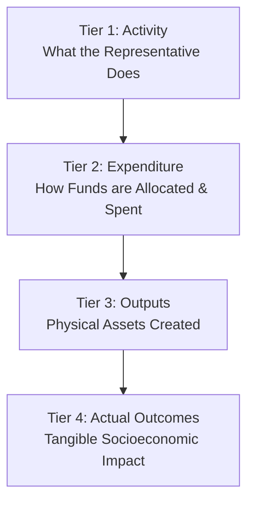

# Phase 6 — Representative Performance & Constituency Development Methodology

## 1. Methodological Principles & Framework

Phase 6 of **CIVICLENS TN** provides an objective, transparent, and non-partisan analytical framework for evaluating Members of the Legislative Assembly (MLAs) and Members of Parliament (MPs) in Tamil Nadu.

The framework adheres to four core principles:
1. **Multi-Dimensional Evaluation:** Performance is not reduced to a single metric. It evaluates legislative work, financial stewardship, physical project delivery, local developmental impact, and promise alignment.
2. **Hierarchy of Evidence:** Clear distinction between operational inputs/activities, financial expenditures, physical outputs, and long-term socioeconomic outcomes.
3. **Contextual Normalization:** Representative metrics are evaluated relative to house/session baselines and historical constituency trends rather than raw absolute counts.
4. **Data Transparency & Non-Fabrication:** Missing or unreleased disclosures are explicitly identified via a Data Completeness Index rather than imputed with synthetic values.

---

## 2. Categorical Distinction of Metrics (The 4-Tier Hierarchy)

A primary flaw in conventional representative scoring is confusing attendance or questions asked with actual developmental progress. CIVICLENS TN enforces a strict 4-tier hierarchy:

### 1. Tier 1: Legislative Activity
- **Definition:** Direct operational actions taken by the elected representative inside the legislative chamber.
- **Metrics:**
  - Session Attendance Percentage ($A_{\text{att}}$)
  - Number of Starred & Unstarred Questions Asked ($Q_{\text{total}}$)
  - Number of Debate Interventions ($D_{\text{total}}$)
  - Private Member Bills Introduced ($B_{\text{pm}}$)

### 2. Tier 2: Financial Expenditure
- **Definition:** The deployment, sanctioning, and spending of public local area development funds (MPLADS / MLACDS).
- **Metrics:**
  - Fund Release Ratio ($\text{FRR} = \text{Released Funds} / \text{Entitlement}$)
  - Fund Utilization Ratio ($\text{FUR} = \text{Actual Expenditure} / \text{Released Funds}$)
  - Unspent Balance Ratio ($\text{UBR} = \text{Unspent Balance} / \text{Total Funds}$)
  - Sanction Velocity ($\text{SV} = \text{Average Days from Recommendation to Sanction}$)

### 3. Tier 3: Physical Outputs
- **Definition:** Direct physical assets, infrastructure deliverables, and local works completed within the constituency.
- **Metrics:**
  - Number of Infrastructure Projects Completed ($W_{\text{completed}}$)
  - Project Completion Rate ($\text{PCR} = W_{\text{completed}} / W_{\text{sanctioned}}$)
  - Sectoral Asset Distribution (Roads km, Classrooms count, Water overhead tanks count, Health sub-center upgrades)

### 4. Tier 4: Actual Socioeconomic Outcomes
- **Definition:** Real-world, long-term developmental improvements in the constituency's living standards and human development indicators.
- **Metrics:**
  - District/Constituency Literacy Rate Delta ($\Delta \text{Lit}$)
  - Infant Mortality & Healthcare Access Delta ($\Delta \text{Health}$)
  - Household Tap Water & Sanitation Coverage Delta ($\Delta \text{Water}$)
  - Rural Electrification & Road Connectivity Delta ($\Delta \text{Infra}$)

---

## 3. Performance Dimensions & Scoring Formulations

The analyzer evaluates representative performance across eight distinct dimensions ($D_1$ to $D_8$).

### Dimension 1: Legislative Participation Score ($S_{\text{leg}}$)
Measures attendance and presence relative to the house average for the session term.

$$S_{\text{leg}} = \min\left(100, \frac{\text{Attendance \%}}{\text{House Avg Attendance \%}} \times 100\right)$$

---

### Dimension 2: Questions & Debates Score ($S_{\text{qnd}}$)
Measures legislative engagement volume and topic diversity.

$$S_{\text{qnd}} = 50 \times \min\left(1, \frac{Q_{\text{rep}}}{Q_{\text{avg}}}\right) + 30 \times \min\left(1, \frac{D_{\text{rep}}}{D_{\text{avg}}}\right) + 20 \times H_{\text{diversity}}$$

*Where $H_{\text{diversity}}$ is the Shannon entropy of question categories across target departments/ministries.*

---

### Dimension 3: Constituency Works Score ($S_{\text{works}}$)
Evaluates the physical completion rate of recommended MPLADS / MLACDS projects.

$$S_{\text{works}} = 70 \times \left(\frac{W_{\text{completed}}}{W_{\text{sanctioned}}}\right) + 30 \times \left(1 - \frac{W_{\text{cancelled}}}{W_{\text{recommended}}}\right)$$

---

### Dimension 4: Project Expenditure Efficiency Score ($S_{\text{exp}}$)
Measures fund utilization speed and fiscal discipline.

$$S_{\text{exp}} = 60 \times \left(\frac{\text{Actual Expenditure}}{\text{Released Funds}}\right) + 40 \times \left(1 - \frac{\text{Unspent Balance}}{\text{Total Entitlement}}\right)$$

---

### Dimension 5: Development Indicator Trend Score ($S_{\text{dev}}$)
Evaluates socioeconomic progress in the constituency against historical baseline indicators ($I_{\text{baseline}}$ to $I_{\text{current}}$).

$$S_{\text{dev}} = \sum_{k=1}^{K} w_k \times \left(\frac{I_{\text{current}, k} - I_{\text{baseline}, k}}{\sigma_k}\right)$$

*Where $w_k$ is the weight of indicator $k$, and $\sigma_k$ is the state-wide standard deviation of improvement for indicator $k$.*

---

### Dimension 6: Promise Alignment Score ($S_{\text{prom}}$)
Cross-references representative legislative questions, debates, and works against Phase 3 manifesto promises of their political party.

$$S_{\text{prom}} = \frac{\text{Count of Questions \& Works Matched to Party Promises}}{\text{Total Party Manifesto Promises Allocated to Constituency Sector}} \times 100$$

---

### Dimension 7: Constituency Issue Coverage Score ($S_{\text{cov}}$)
Cross-references local news coverage from Phase 4 (`ArticleEntity`, `CoverageMetric`) with legislative questions asked, evaluating whether top local media issues were raised in the Assembly/Parliament.

$$S_{\text{cov}} = \text{Cosine Similarity}\left(\mathbf{v}_{\text{news\_topics}}, \mathbf{v}_{\text{legislative\_questions}}\right) \times 100$$

---

### Dimension 8: Data Completeness Score ($S_{\text{comp}}$)
Calculates the transparency and availability ratio of official disclosures for the representative's term.

$$S_{\text{comp}} = \frac{\text{Number of Disclosed Metric Fields}}{\text{Total Required Statutory Reporting Fields}} \times 100$$

---

## 4. Overall Composite Performance Rating

The overall representative performance rating ($S_{\text{overall}}$) is computed as a weighted sum of normalized dimension scores:

$$S_{\text{overall}} = w_1 S_{\text{leg}} + w_2 S_{\text{qnd}} + w_3 S_{\text{works}} + w_4 S_{\text{exp}} + w_5 S_{\text{dev}} + w_6 S_{\text{prom}} + w_7 S_{\text{cov}} + w_8 S_{\text{comp}}$$

### Default Weight Allocations:
- **$w_1$ (Legislative Participation):** $0.15$
- **$w_2$ (Questions & Debates):** $0.15$
- **$w_3$ (Constituency Works Output):** $0.20$
- **$w_4$ (Expenditure Efficiency):** $0.15$
- **$w_5$ (Development Outcomes):** $0.15$
- **$w_6$ (Promise Alignment):** $0.10$
- **$w_7$ (Issue Media Alignment):** $0.05$
- **$w_8$ (Data Completeness Penalty):** Penalty factor (multiplier between $0.50$ and $1.00$).

---

## 5. Delimitation & Entity Resolution Methodology

1. **Delimitation Boundary Mapping:** 2008 Delimitation Commission boundaries are enforced for post-2008 assembly terms. Historical pre-2008 data is tagged with delimitation era flags (`DELIMITATION_1976` vs `DELIMITATION_2008`).
2. **Name Matching & Transliteration:** Bilingual representative names (Tamil and English) are resolved using Levenshtein distance and Tamil phonetic transliteration mapping, linking ECI candidate IDs with Phase 4 `PoliticalPerson` records.
3. **Multi-Term Representative Tracking:** A representative serving multiple terms (e.g. 2011–2016 and 2021–Present) has separate `RepresentativeTerm` records to evaluate performance trajectory over time.
